# A. Hypothesis 

I am interested in the allocation of resources by neighborhoods in New York City. Specifically, I think that neighborhoods that are more highly valued likely receive more funding for public school capital projects.

Based on a dataset of properties sold in New York City in the last twelve-month period (March 2018 to February 2019) and current school capital improvements taking place, I hypothesize that more expensive neighborhoods(i.e. those zip codes with the highest sale price per square foot) have a strong positive correlation to their school capital construction funding.

# B. First Data Set - Value of Properties Sold


**1**. The Department of Finance’s [Rolling Sales files](https://www1.nyc.gov/site/finance/taxes/property-rolling-sales-data.page) lists properties that sold in the last twelve-month period (March 2018 to February 2019) in the five boroughs of New York City for all tax classes. These five files include the following data related to the property:

    - the neighborhood;
    - building type;
    - zip code;
    - square footage;
    - sale price;
    - other data.


**2**. Based on the accompanying [Data Dictionary](https://www1.nyc.gov/assets/finance/downloads/tar/tarfieldcodes.pdf), the Borough Codes are:
    
    1 = MANHATTAN
    2 = BRONX
    3 = BROOKLYN
    4 = QUEENS
    5 = STATEN ISLAND 


```python
import pandas as pd
import os
import numpy as np

import warnings
warnings.filterwarnings('ignore')

import matplotlib.pyplot as plt
import seaborn as sns

from sklearn.neighbors import KNeighborsClassifier
from sklearn import datasets
from sklearn.pipeline import Pipeline, FeatureUnion
from sklearn.model_selection import GridSearchCV
from sklearn.metrics import classification_report, confusion_matrix  
from sklearn.model_selection import train_test_split
from sklearn.neighbors import KNeighborsClassifier
from sklearn.preprocessing import StandardScaler
from sklearn.metrics import f1_score
from scipy.stats import shapiro

```

### 1. Transform five downloaded excel files into Dataframes


```python
#get listing of all xls files in folder
path = os.getcwd()
arr = os.listdir(path)
xls_files = [file for file in arr if '.xls' in file]
```


```python
df_names = [(xls_files[i].split('.')[0].split('_')[1]) for i in range(len(xls_files))]
df_names
```


    ['bronx', 'manhattan', 'brooklyn', 'statenisland', 'queens']


```python
bronx = pd.read_excel('rollingsales_bronx.xls')
manhattan = pd.read_excel('rollingsales_manhattan.xls')
brooklyn=pd.read_excel('rollingsales_brooklyn.xls')
statenisland=pd.read_excel( 'rollingsales_statenisland.xls')
queens = pd.read_excel('rollingsales_queens.xls')
```


```python
bronx.head() #need to get rid of first couple of rows
```


<div>
<style scoped>
    .dataframe tbody tr th:only-of-type {
        vertical-align: middle;
    }

    .dataframe tbody tr th {
        vertical-align: top;
    }

    .dataframe thead th {
        text-align: right;
    }
</style>
<table border="1" class="dataframe">
  <thead>
    <tr style="text-align: right;">
      <th></th>
      <th>Bronx Rolling Sales File.  All Sales From March 2018 - February 2019.</th>
      <th>Unnamed: 1</th>
      <th>Unnamed: 2</th>
      <th>Unnamed: 3</th>
      <th>Unnamed: 4</th>
      <th>Unnamed: 5</th>
      <th>Unnamed: 6</th>
      <th>Unnamed: 7</th>
      <th>Unnamed: 8</th>
      <th>Unnamed: 9</th>
      <th>...</th>
      <th>Unnamed: 11</th>
      <th>Unnamed: 12</th>
      <th>Unnamed: 13</th>
      <th>Unnamed: 14</th>
      <th>Unnamed: 15</th>
      <th>Unnamed: 16</th>
      <th>Unnamed: 17</th>
      <th>Unnamed: 18</th>
      <th>Unnamed: 19</th>
      <th>Unnamed: 20</th>
    </tr>
  </thead>
  <tbody>
    <tr>
      <th>0</th>
      <td>Sales as of 3/22/2019.</td>
      <td>NaN</td>
      <td>NaN</td>
      <td>NaN</td>
      <td>NaN</td>
      <td>NaN</td>
      <td>NaN</td>
      <td>NaN</td>
      <td>NaN</td>
      <td>NaN</td>
      <td>...</td>
      <td>NaN</td>
      <td>NaN</td>
      <td>NaN</td>
      <td>NaN</td>
      <td>NaN</td>
      <td>NaN</td>
      <td>NaN</td>
      <td>NaN</td>
      <td>NaN</td>
      <td>NaN</td>
    </tr>
    <tr>
      <th>1</th>
      <td>Neighborhood Names and Descriptive Data as of ...</td>
      <td>NaN</td>
      <td>NaN</td>
      <td>NaN</td>
      <td>NaN</td>
      <td>NaN</td>
      <td>NaN</td>
      <td>NaN</td>
      <td>NaN</td>
      <td>NaN</td>
      <td>...</td>
      <td>NaN</td>
      <td>NaN</td>
      <td>NaN</td>
      <td>NaN</td>
      <td>NaN</td>
      <td>NaN</td>
      <td>NaN</td>
      <td>NaN</td>
      <td>NaN</td>
      <td>NaN</td>
    </tr>
    <tr>
      <th>2</th>
      <td>Building Class Category is based on Building C...</td>
      <td>NaN</td>
      <td>NaN</td>
      <td>NaN</td>
      <td>NaN</td>
      <td>NaN</td>
      <td>NaN</td>
      <td>NaN</td>
      <td>NaN</td>
      <td>NaN</td>
      <td>...</td>
      <td>NaN</td>
      <td>NaN</td>
      <td>NaN</td>
      <td>NaN</td>
      <td>NaN</td>
      <td>NaN</td>
      <td>NaN</td>
      <td>NaN</td>
      <td>NaN</td>
      <td>NaN</td>
    </tr>
    <tr>
      <th>3</th>
      <td>BOROUGH</td>
      <td>NEIGHBORHOOD</td>
      <td>BUILDING CLASS CATEGORY</td>
      <td>TAX CLASS AT PRESENT</td>
      <td>BLOCK</td>
      <td>LOT</td>
      <td>EASE-MENT</td>
      <td>BUILDING CLASS AT PRESENT</td>
      <td>ADDRESS</td>
      <td>APARTMENT NUMBER</td>
      <td>...</td>
      <td>RESIDENTIAL UNITS</td>
      <td>COMMERCIAL UNITS</td>
      <td>TOTAL UNITS</td>
      <td>LAND SQUARE FEET</td>
      <td>GROSS SQUARE FEET</td>
      <td>YEAR BUILT</td>
      <td>TAX CLASS AT TIME OF SALE</td>
      <td>BUILDING CLASS AT TIME OF SALE</td>
      <td>SALE PRICE</td>
      <td>SALE DATE</td>
    </tr>
    <tr>
      <th>4</th>
      <td>2</td>
      <td>BATHGATE</td>
      <td>01 ONE FAMILY DWELLINGS</td>
      <td>1</td>
      <td>2907</td>
      <td>24</td>
      <td>NaN</td>
      <td>A1</td>
      <td>4090 PARK AVENUE</td>
      <td>NaN</td>
      <td>...</td>
      <td>1</td>
      <td>0</td>
      <td>1</td>
      <td>2500</td>
      <td>1474</td>
      <td>1901</td>
      <td>1</td>
      <td>A1</td>
      <td>241500</td>
      <td>2018-08-17 00:00:00</td>
    </tr>
  </tbody>
</table>
<p>5 rows × 21 columns</p>
</div>


```python
dfs = [bronx, manhattan, brooklyn, statenisland, queens]
```


```python
for df in dfs:
    df.columns= df.iloc[3] #sets column headers to the 4th row
#     df.drop(df.index[0:4]) #this line not working through For loops, will get rid of nans once combine all dfs

```

### 2. Combine all boroughs' data into one dataframe and clean up columns

- Filtered 'BOROUGH' Column by integer to make sure only numeric values were included
- Dropped'EASE-MENT','APARTMENT NUMBER' features - too many null vals


```python
large_df = pd.DataFrame()#empty df
for df in dfs:
    large_df = large_df.append(df)
```


```python
large_df.head()
```


<div>
<style scoped>
    .dataframe tbody tr th:only-of-type {
        vertical-align: middle;
    }

    .dataframe tbody tr th {
        vertical-align: top;
    }

    .dataframe thead th {
        text-align: right;
    }
</style>
<table border="1" class="dataframe">
  <thead>
    <tr style="text-align: right;">
      <th>3</th>
      <th>BOROUGH</th>
      <th>NEIGHBORHOOD</th>
      <th>BUILDING CLASS CATEGORY</th>
      <th>TAX CLASS AT PRESENT</th>
      <th>BLOCK</th>
      <th>LOT</th>
      <th>EASE-MENT</th>
      <th>BUILDING CLASS AT PRESENT</th>
      <th>ADDRESS</th>
      <th>APARTMENT NUMBER</th>
      <th>...</th>
      <th>RESIDENTIAL UNITS</th>
      <th>COMMERCIAL UNITS</th>
      <th>TOTAL UNITS</th>
      <th>LAND SQUARE FEET</th>
      <th>GROSS SQUARE FEET</th>
      <th>YEAR BUILT</th>
      <th>TAX CLASS AT TIME OF SALE</th>
      <th>BUILDING CLASS AT TIME OF SALE</th>
      <th>SALE PRICE</th>
      <th>SALE DATE</th>
    </tr>
  </thead>
  <tbody>
    <tr>
      <th>0</th>
      <td>Sales as of 3/22/2019.</td>
      <td>NaN</td>
      <td>NaN</td>
      <td>NaN</td>
      <td>NaN</td>
      <td>NaN</td>
      <td>NaN</td>
      <td>NaN</td>
      <td>NaN</td>
      <td>NaN</td>
      <td>...</td>
      <td>NaN</td>
      <td>NaN</td>
      <td>NaN</td>
      <td>NaN</td>
      <td>NaN</td>
      <td>NaN</td>
      <td>NaN</td>
      <td>NaN</td>
      <td>NaN</td>
      <td>NaN</td>
    </tr>
    <tr>
      <th>1</th>
      <td>Neighborhood Names and Descriptive Data as of ...</td>
      <td>NaN</td>
      <td>NaN</td>
      <td>NaN</td>
      <td>NaN</td>
      <td>NaN</td>
      <td>NaN</td>
      <td>NaN</td>
      <td>NaN</td>
      <td>NaN</td>
      <td>...</td>
      <td>NaN</td>
      <td>NaN</td>
      <td>NaN</td>
      <td>NaN</td>
      <td>NaN</td>
      <td>NaN</td>
      <td>NaN</td>
      <td>NaN</td>
      <td>NaN</td>
      <td>NaN</td>
    </tr>
    <tr>
      <th>2</th>
      <td>Building Class Category is based on Building C...</td>
      <td>NaN</td>
      <td>NaN</td>
      <td>NaN</td>
      <td>NaN</td>
      <td>NaN</td>
      <td>NaN</td>
      <td>NaN</td>
      <td>NaN</td>
      <td>NaN</td>
      <td>...</td>
      <td>NaN</td>
      <td>NaN</td>
      <td>NaN</td>
      <td>NaN</td>
      <td>NaN</td>
      <td>NaN</td>
      <td>NaN</td>
      <td>NaN</td>
      <td>NaN</td>
      <td>NaN</td>
    </tr>
    <tr>
      <th>3</th>
      <td>BOROUGH</td>
      <td>NEIGHBORHOOD</td>
      <td>BUILDING CLASS CATEGORY</td>
      <td>TAX CLASS AT PRESENT</td>
      <td>BLOCK</td>
      <td>LOT</td>
      <td>EASE-MENT</td>
      <td>BUILDING CLASS AT PRESENT</td>
      <td>ADDRESS</td>
      <td>APARTMENT NUMBER</td>
      <td>...</td>
      <td>RESIDENTIAL UNITS</td>
      <td>COMMERCIAL UNITS</td>
      <td>TOTAL UNITS</td>
      <td>LAND SQUARE FEET</td>
      <td>GROSS SQUARE FEET</td>
      <td>YEAR BUILT</td>
      <td>TAX CLASS AT TIME OF SALE</td>
      <td>BUILDING CLASS AT TIME OF SALE</td>
      <td>SALE PRICE</td>
      <td>SALE DATE</td>
    </tr>
    <tr>
      <th>4</th>
      <td>2</td>
      <td>BATHGATE</td>
      <td>01 ONE FAMILY DWELLINGS</td>
      <td>1</td>
      <td>2907</td>
      <td>24</td>
      <td>NaN</td>
      <td>A1</td>
      <td>4090 PARK AVENUE</td>
      <td>NaN</td>
      <td>...</td>
      <td>1</td>
      <td>0</td>
      <td>1</td>
      <td>2500</td>
      <td>1474</td>
      <td>1901</td>
      <td>1</td>
      <td>A1</td>
      <td>241500</td>
      <td>2018-08-17 00:00:00</td>
    </tr>
  </tbody>
</table>
<p>5 rows × 21 columns</p>
</div>


```python
large_df.shape
```


    (81767, 21)


```python
large_df.isnull().sum() #summary of null values by column
```


    3
    BOROUGH                               0
    NEIGHBORHOOD                         15
    BUILDING CLASS CATEGORY              15
    TAX CLASS AT PRESENT                 73
    BLOCK                                15
    LOT                                  15
    EASE-MENT                         81762
    BUILDING CLASS AT PRESENT            73
    ADDRESS                              15
    APARTMENT NUMBER                  63886
    ZIP CODE                             29
    RESIDENTIAL UNITS                    73
    COMMERCIAL UNITS                     73
    TOTAL UNITS                          73
    LAND SQUARE FEET                     76
    GROSS SQUARE FEET                    73
    YEAR BUILT                           34
    TAX CLASS AT TIME OF SALE            15
    BUILDING CLASS AT TIME OF SALE       15
    SALE PRICE                           15
    SALE DATE                            15
    dtype: int64


```python
large_df.BOROUGH.unique() #will use this column to get rid of any superfluous values
# (i.e. the borough column should only contain integers)
```


    array(['Sales as of 3/22/2019.',
           'Neighborhood Names and Descriptive Data as of 3/22/2019',
           'Building Class Category is based on Building Class at Time of Sale.',
           'BOROUGH', 2, 1, 3, 5, 4], dtype=object)


```python
type(large_df.iloc[4].BOROUGH)
```


    int


```python
large_df = large_df[large_df.BOROUGH.apply(type) == int]
large_df.head()
```


<div>
<style scoped>
    .dataframe tbody tr th:only-of-type {
        vertical-align: middle;
    }

    .dataframe tbody tr th {
        vertical-align: top;
    }

    .dataframe thead th {
        text-align: right;
    }
</style>
<table border="1" class="dataframe">
  <thead>
    <tr style="text-align: right;">
      <th>3</th>
      <th>BOROUGH</th>
      <th>NEIGHBORHOOD</th>
      <th>BUILDING CLASS CATEGORY</th>
      <th>TAX CLASS AT PRESENT</th>
      <th>BLOCK</th>
      <th>LOT</th>
      <th>EASE-MENT</th>
      <th>BUILDING CLASS AT PRESENT</th>
      <th>ADDRESS</th>
      <th>APARTMENT NUMBER</th>
      <th>...</th>
      <th>RESIDENTIAL UNITS</th>
      <th>COMMERCIAL UNITS</th>
      <th>TOTAL UNITS</th>
      <th>LAND SQUARE FEET</th>
      <th>GROSS SQUARE FEET</th>
      <th>YEAR BUILT</th>
      <th>TAX CLASS AT TIME OF SALE</th>
      <th>BUILDING CLASS AT TIME OF SALE</th>
      <th>SALE PRICE</th>
      <th>SALE DATE</th>
    </tr>
  </thead>
  <tbody>
    <tr>
      <th>4</th>
      <td>2</td>
      <td>BATHGATE</td>
      <td>01 ONE FAMILY DWELLINGS</td>
      <td>1</td>
      <td>2907</td>
      <td>24</td>
      <td>NaN</td>
      <td>A1</td>
      <td>4090 PARK AVENUE</td>
      <td>NaN</td>
      <td>...</td>
      <td>1</td>
      <td>0</td>
      <td>1</td>
      <td>2500</td>
      <td>1474</td>
      <td>1901</td>
      <td>1</td>
      <td>A1</td>
      <td>241500</td>
      <td>2018-08-17 00:00:00</td>
    </tr>
    <tr>
      <th>5</th>
      <td>2</td>
      <td>BATHGATE</td>
      <td>01 ONE FAMILY DWELLINGS</td>
      <td>1</td>
      <td>3030</td>
      <td>62</td>
      <td>NaN</td>
      <td>A1</td>
      <td>4463 PARK AVENUE</td>
      <td>NaN</td>
      <td>...</td>
      <td>1</td>
      <td>0</td>
      <td>1</td>
      <td>1578</td>
      <td>1470</td>
      <td>1899</td>
      <td>1</td>
      <td>A1</td>
      <td>455000</td>
      <td>2018-11-28 00:00:00</td>
    </tr>
    <tr>
      <th>6</th>
      <td>2</td>
      <td>BATHGATE</td>
      <td>01 ONE FAMILY DWELLINGS</td>
      <td>1</td>
      <td>3030</td>
      <td>62</td>
      <td>NaN</td>
      <td>A1</td>
      <td>4463 PARK AVENUE</td>
      <td>NaN</td>
      <td>...</td>
      <td>1</td>
      <td>0</td>
      <td>1</td>
      <td>1578</td>
      <td>1470</td>
      <td>1899</td>
      <td>1</td>
      <td>A1</td>
      <td>180000</td>
      <td>2018-03-22 00:00:00</td>
    </tr>
    <tr>
      <th>7</th>
      <td>2</td>
      <td>BATHGATE</td>
      <td>01 ONE FAMILY DWELLINGS</td>
      <td>1</td>
      <td>3030</td>
      <td>70</td>
      <td>NaN</td>
      <td>A1</td>
      <td>4445 PARK AVENUE</td>
      <td>NaN</td>
      <td>...</td>
      <td>1</td>
      <td>0</td>
      <td>1</td>
      <td>1694</td>
      <td>1497</td>
      <td>1899</td>
      <td>1</td>
      <td>A1</td>
      <td>255000</td>
      <td>2018-03-05 00:00:00</td>
    </tr>
    <tr>
      <th>8</th>
      <td>2</td>
      <td>BATHGATE</td>
      <td>01 ONE FAMILY DWELLINGS</td>
      <td>1</td>
      <td>3039</td>
      <td>63</td>
      <td>NaN</td>
      <td>A1</td>
      <td>469 E 185TH ST</td>
      <td>NaN</td>
      <td>...</td>
      <td>1</td>
      <td>0</td>
      <td>1</td>
      <td>1650</td>
      <td>1296</td>
      <td>1910</td>
      <td>1</td>
      <td>A1</td>
      <td>419000</td>
      <td>2018-12-20 00:00:00</td>
    </tr>
  </tbody>
</table>
<p>5 rows × 21 columns</p>
</div>


```python
large_df.isnull().sum()
```


    3
    BOROUGH                               0
    NEIGHBORHOOD                          0
    BUILDING CLASS CATEGORY               0
    TAX CLASS AT PRESENT                 58
    BLOCK                                 0
    LOT                                   0
    EASE-MENT                         81747
    BUILDING CLASS AT PRESENT            58
    ADDRESS                               0
    APARTMENT NUMBER                  63871
    ZIP CODE                             14
    RESIDENTIAL UNITS                    58
    COMMERCIAL UNITS                     58
    TOTAL UNITS                          58
    LAND SQUARE FEET                     61
    GROSS SQUARE FEET                    58
    YEAR BUILT                           19
    TAX CLASS AT TIME OF SALE             0
    BUILDING CLASS AT TIME OF SALE        0
    SALE PRICE                            0
    SALE DATE                             0
    dtype: int64


```python
#based on above, drop EASE-MENT and APARTMENT NUMBER - too many null values, won't be very helpful
large_df = large_df.drop(columns=['EASE-MENT','APARTMENT NUMBER'])
```


```python
large_df.describe(include = 'all')
```


<div>
<style scoped>
    .dataframe tbody tr th:only-of-type {
        vertical-align: middle;
    }

    .dataframe tbody tr th {
        vertical-align: top;
    }

    .dataframe thead th {
        text-align: right;
    }
</style>
<table border="1" class="dataframe">
  <thead>
    <tr style="text-align: right;">
      <th>3</th>
      <th>BOROUGH</th>
      <th>NEIGHBORHOOD</th>
      <th>BUILDING CLASS CATEGORY</th>
      <th>TAX CLASS AT PRESENT</th>
      <th>BLOCK</th>
      <th>LOT</th>
      <th>BUILDING CLASS AT PRESENT</th>
      <th>ADDRESS</th>
      <th>ZIP CODE</th>
      <th>RESIDENTIAL UNITS</th>
      <th>COMMERCIAL UNITS</th>
      <th>TOTAL UNITS</th>
      <th>LAND SQUARE FEET</th>
      <th>GROSS SQUARE FEET</th>
      <th>YEAR BUILT</th>
      <th>TAX CLASS AT TIME OF SALE</th>
      <th>BUILDING CLASS AT TIME OF SALE</th>
      <th>SALE PRICE</th>
      <th>SALE DATE</th>
    </tr>
  </thead>
  <tbody>
    <tr>
      <th>count</th>
      <td>81747</td>
      <td>81747</td>
      <td>81747</td>
      <td>81689</td>
      <td>81747</td>
      <td>81747</td>
      <td>81689</td>
      <td>81747</td>
      <td>81733</td>
      <td>81689</td>
      <td>81689</td>
      <td>81689</td>
      <td>81686</td>
      <td>81689</td>
      <td>81728</td>
      <td>81747</td>
      <td>81747</td>
      <td>81747</td>
      <td>81747</td>
    </tr>
    <tr>
      <th>unique</th>
      <td>5</td>
      <td>252</td>
      <td>45</td>
      <td>10</td>
      <td>11694</td>
      <td>2694</td>
      <td>165</td>
      <td>69335</td>
      <td>185</td>
      <td>168</td>
      <td>70</td>
      <td>180</td>
      <td>6765</td>
      <td>6478</td>
      <td>168</td>
      <td>3</td>
      <td>165</td>
      <td>8980</td>
      <td>365</td>
    </tr>
    <tr>
      <th>top</th>
      <td>4</td>
      <td>FLUSHING-NORTH</td>
      <td>01 ONE FAMILY DWELLINGS</td>
      <td>1</td>
      <td>1171</td>
      <td>1</td>
      <td>D4</td>
      <td>401 EAST 60TH STREET</td>
      <td>10314</td>
      <td>1</td>
      <td>0</td>
      <td>1</td>
      <td>0</td>
      <td>0</td>
      <td>0</td>
      <td>1</td>
      <td>D4</td>
      <td>0</td>
      <td>2018-06-28 00:00:00</td>
    </tr>
    <tr>
      <th>freq</th>
      <td>25842</td>
      <td>2428</td>
      <td>18699</td>
      <td>39035</td>
      <td>221</td>
      <td>3867</td>
      <td>12166</td>
      <td>97</td>
      <td>1496</td>
      <td>33834</td>
      <td>74262</td>
      <td>36946</td>
      <td>27197</td>
      <td>19680</td>
      <td>6209</td>
      <td>41784</td>
      <td>12166</td>
      <td>24736</td>
      <td>570</td>
    </tr>
  </tbody>
</table>
</div>


### 3. Clean up Sale Price

- Dropped sale prices lower than 10 dollars -there were 25K+ rows with these values; this would skew data set


```python
type(large_df['SALE PRICE'].iloc[4]) #already integer
```


    int


```python
large_df['SALE PRICE'] #includes a lot of $0 and $10 prices
```


    4          241500
    5          455000
    6          180000
    7          255000
    8          419000
    9          305000
    10         445000
    11         365000
    12         375000
    13         375000
    14         350000
    15         600000
    16              0
    17         470000
    18              0
    19         540000
    20         318500
    21         679000
    22         514216
    23         570000
    24         520000
    25              0
    26         415000
    27         725000
    28         640000
    29         635000
    30         400000
    31         453000
    32         336000
    33         450000
               ...   
    25816           0
    25817           0
    25818      400000
    25819     2150000
    25820      280000
    25821    10250000
    25822     3675000
    25823     3580000
    25824           0
    25825    10500000
    25826     5480000
    25827     3500000
    25828     8000000
    25829           0
    25830     3600000
    25831     1250000
    25832     1750000
    25833     2100000
    25834           0
    25835           0
    25836           0
    25837       25000
    25838           0
    25839           0
    25840           0
    25841       28000
    25842          10
    25843           0
    25844           0
    25845           0
    Name: SALE PRICE, Length: 81747, dtype: object


```python
np.sum(large_df['SALE PRICE']==0) # number of values equal to zero - this will affect the average price, 
# it's possible these were actually sold for zero value (e.g. Like Kind Exchange), but will drop these

```


    24736


```python
np.sum(large_df['SALE PRICE'].between(1,10, inclusive = True)) # also a lot of values between 1 and 10; will also drop these
```


    894


```python
np.sum(large_df['SALE PRICE'].between(11,1000, inclusive = True)) 
```


    261


```python
np.sum(large_df['SALE PRICE'].between(101,1000, inclusive = True))
```


    164


```python
np.sum(large_df['SALE PRICE'].between(1001,2000, inclusive = True))
```


    20


```python
df = large_df[large_df['SALE PRICE']>10] #set up a new df to only include sales prices larger than $10
```


```python
df.shape
```


    (56117, 19)


```python
df.describe(include = 'all')
```


<div>
<style scoped>
    .dataframe tbody tr th:only-of-type {
        vertical-align: middle;
    }

    .dataframe tbody tr th {
        vertical-align: top;
    }

    .dataframe thead th {
        text-align: right;
    }
</style>
<table border="1" class="dataframe">
  <thead>
    <tr style="text-align: right;">
      <th>3</th>
      <th>BOROUGH</th>
      <th>NEIGHBORHOOD</th>
      <th>BUILDING CLASS CATEGORY</th>
      <th>TAX CLASS AT PRESENT</th>
      <th>BLOCK</th>
      <th>LOT</th>
      <th>BUILDING CLASS AT PRESENT</th>
      <th>ADDRESS</th>
      <th>ZIP CODE</th>
      <th>RESIDENTIAL UNITS</th>
      <th>COMMERCIAL UNITS</th>
      <th>TOTAL UNITS</th>
      <th>LAND SQUARE FEET</th>
      <th>GROSS SQUARE FEET</th>
      <th>YEAR BUILT</th>
      <th>TAX CLASS AT TIME OF SALE</th>
      <th>BUILDING CLASS AT TIME OF SALE</th>
      <th>SALE PRICE</th>
      <th>SALE DATE</th>
    </tr>
  </thead>
  <tbody>
    <tr>
      <th>count</th>
      <td>56117</td>
      <td>56117</td>
      <td>56117</td>
      <td>56075</td>
      <td>56117</td>
      <td>56117</td>
      <td>56075</td>
      <td>56117</td>
      <td>56107</td>
      <td>56075</td>
      <td>56075</td>
      <td>56075</td>
      <td>56072</td>
      <td>56075</td>
      <td>56102</td>
      <td>56117</td>
      <td>56117</td>
      <td>56117</td>
      <td>56117</td>
    </tr>
    <tr>
      <th>unique</th>
      <td>5</td>
      <td>251</td>
      <td>44</td>
      <td>10</td>
      <td>10617</td>
      <td>2329</td>
      <td>159</td>
      <td>49174</td>
      <td>185</td>
      <td>119</td>
      <td>53</td>
      <td>133</td>
      <td>5478</td>
      <td>5194</td>
      <td>158</td>
      <td>3</td>
      <td>158</td>
      <td>8972</td>
      <td>329</td>
    </tr>
    <tr>
      <th>top</th>
      <td>4</td>
      <td>FLUSHING-NORTH</td>
      <td>01 ONE FAMILY DWELLINGS</td>
      <td>1</td>
      <td>16</td>
      <td>1</td>
      <td>D4</td>
      <td>184 KENT AVENUE</td>
      <td>10314</td>
      <td>1</td>
      <td>0</td>
      <td>1</td>
      <td>0</td>
      <td>0</td>
      <td>1920</td>
      <td>2</td>
      <td>D4</td>
      <td>650000</td>
      <td>2018-06-28 00:00:00</td>
    </tr>
    <tr>
      <th>freq</th>
      <td>17530</td>
      <td>1563</td>
      <td>12938</td>
      <td>24979</td>
      <td>156</td>
      <td>3007</td>
      <td>10691</td>
      <td>63</td>
      <td>1039</td>
      <td>24381</td>
      <td>52502</td>
      <td>25502</td>
      <td>21648</td>
      <td>15722</td>
      <td>4012</td>
      <td>26744</td>
      <td>10691</td>
      <td>444</td>
      <td>408</td>
    </tr>
  </tbody>
</table>
</div>


```python
borough_df = df[['BOROUGH','SALE PRICE','ZIP CODE']]
borough_df = borough_df.astype(float)
```


```python
for n in range(1,6):
    print(n, borough_df[borough_df.BOROUGH == n].count())
```

    1 3
    BOROUGH       12754
    SALE PRICE    12754
    ZIP CODE      12753
    dtype: int64
    2 3
    BOROUGH       5535
    SALE PRICE    5535
    ZIP CODE      5535
    dtype: int64
    3 3
    BOROUGH       14323
    SALE PRICE    14323
    ZIP CODE      14320
    dtype: int64
    4 3
    BOROUGH       17530
    SALE PRICE    17530
    ZIP CODE      17525
    dtype: int64
    5 3
    BOROUGH       5975
    SALE PRICE    5975
    ZIP CODE      5974
    dtype: int64


```python
price_df = df['SALE PRICE'].apply(lambda x: x/1000).astype('float').to_frame()
price_df.boxplot(figsize = (10,5),vert=False,fontsize=14)
plt.suptitle("Price Box Plot for Sale Price in Thousands of $",fontsize = 20)
```


    Text(0.5, 0.98, 'Price Box Plot for Sale Price in Thousands of $')


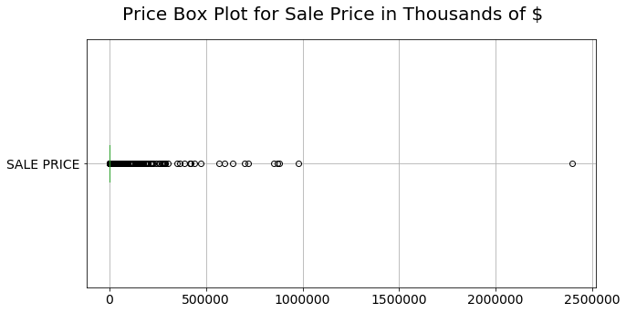


### 4. Clean Up Zip Code, Fill NaN values

- Since analysis will be done based on zip code, created a function to look up 'neighborhood' column corresponding to missing and '0' listed zip code values
- Created and sorted dictionary by the counts associated with each zip to make sure there were, overall, enough data points by zipcode 


```python
len(df['ZIP CODE'].unique())
```


    186


```python
len(large_df['ZIP CODE'].unique()) #didn't lose any unique zip codes when getting rid of zero and $10 sale prices
```


    186


```python
df.isnull().sum() #10 zip codes are empty, but no neighborhoods are empty; lookup missing zips by neighborhood
```


    3
    BOROUGH                            0
    NEIGHBORHOOD                       0
    BUILDING CLASS CATEGORY            0
    TAX CLASS AT PRESENT              42
    BLOCK                              0
    LOT                                0
    BUILDING CLASS AT PRESENT         42
    ADDRESS                            0
    ZIP CODE                          10
    RESIDENTIAL UNITS                 42
    COMMERCIAL UNITS                  42
    TOTAL UNITS                       42
    LAND SQUARE FEET                  45
    GROSS SQUARE FEET                 42
    YEAR BUILT                        15
    TAX CLASS AT TIME OF SALE          0
    BUILDING CLASS AT TIME OF SALE     0
    SALE PRICE                         0
    SALE DATE                          0
    dtype: int64


```python
def zip_lookup(mask): #mask needs to be a df
    zip_dict = {}
    missing_zips = list(df[mask]['NEIGHBORHOOD'])
    for mz in missing_zips:
        zip_dict[mz] = df['ZIP CODE'].loc[df['NEIGHBORHOOD'] == mz].unique()[0]
#     return(zip_dict)
    df.loc[mask,'ZIP CODE'] = df.loc[mask, 'NEIGHBORHOOD'].map(zip_dict)
    
```


```python
zip_lookup(df['ZIP CODE'].isnull())
```


```python
zip_lookup(df['ZIP CODE']==0)
```


```python
np.sum(df['ZIP CODE']==0),

```


    (0,)


```python
df['ZIP CODE'].isnull().sum()
```


    0


```python
df.shape
```


    (56117, 19)


```python
df.isnull().sum()
```


    3
    BOROUGH                            0
    NEIGHBORHOOD                       0
    BUILDING CLASS CATEGORY            0
    TAX CLASS AT PRESENT              42
    BLOCK                              0
    LOT                                0
    BUILDING CLASS AT PRESENT         42
    ADDRESS                            0
    ZIP CODE                           0
    RESIDENTIAL UNITS                 42
    COMMERCIAL UNITS                  42
    TOTAL UNITS                       42
    LAND SQUARE FEET                  45
    GROSS SQUARE FEET                 42
    YEAR BUILT                        15
    TAX CLASS AT TIME OF SALE          0
    BUILDING CLASS AT TIME OF SALE     0
    SALE PRICE                         0
    SALE DATE                          0
    dtype: int64


```python
#checking the number of values per zip code
zip_counts = {}
for zipcode in df['ZIP CODE'].unique():
    zip_counts[zipcode] = len(df.loc[df['ZIP CODE'] == zipcode])

sorted_d = sorted(zip_counts.items(), key=lambda x: x[1])
sorted_d
```


    [(11227, 1),
     (11430, 1),
     (10105, 2),
     (11239, 8),
     (10282, 10),
     (10044, 21),
     (11109, 22),
     (10006, 33),
     (11040, 33),
     (11001, 43),
     (10475, 48),
     (10037, 48),
     (10039, 54),
     (10474, 56),
     (10454, 59),
     (10004, 60),
     (10464, 66),
     (10035, 73),
     (10455, 75),
     (10018, 76),
     (10034, 79),
     (10030, 80),
     (11363, 81),
     (10069, 85),
     (11697, 86),
     (10280, 88),
     (11693, 91),
     (10452, 98),
     (10040, 100),
     (11692, 100),
     (11237, 103),
     (11104, 103),
     (10453, 112),
     (10029, 113),
     (11005, 113),
     (10470, 115),
     (10032, 116),
     (10459, 117),
     (11103, 119),
     (10005, 122),
     (11232, 122),
     (10033, 125),
     (10451, 128),
     (10468, 131),
     (11102, 132),
     (11105, 136),
     (10031, 148),
     (10038, 149),
     (11366, 153),
     (11416, 153),
     (11004, 156),
     (11428, 157),
     (11427, 157),
     (11370, 163),
     (10456, 164),
     (11415, 165),
     (10458, 170),
     (10460, 172),
     (10007, 173),
     (10457, 179),
     (11694, 181),
     (11212, 189),
     (10001, 190),
     (10027, 195),
     (11411, 196),
     (10036, 198),
     (11225, 200),
     (10009, 201),
     (11426, 208),
     (11356, 208),
     (10026, 210),
     (11213, 210),
     (10307, 214),
     (11106, 215),
     (11224, 223),
     (10472, 224),
     (11228, 232),
     (11365, 235),
     (11429, 236),
     (11205, 237),
     (11423, 245),
     (10012, 248),
     (11418, 251),
     (11231, 253),
     (11379, 255),
     (11206, 257),
     (10473, 261),
     (11419, 261),
     (10302, 264),
     (11417, 266),
     (11249, 267),
     (11378, 267),
     (11362, 273),
     (10471, 279),
     (11222, 279),
     (11436, 280),
     (11422, 282),
     (11358, 283),
     (10310, 284),
     (11361, 287),
     (11220, 289),
     (11369, 289),
     (11421, 295),
     (11432, 321),
     (11691, 323),
     (11360, 323),
     (11210, 327),
     (10461, 334),
     (10467, 339),
     (11223, 340),
     (10303, 340),
     (11219, 343),
     (11433, 343),
     (10002, 345),
     (11420, 345),
     (10010, 347),
     (11211, 349),
     (11216, 350),
     (11226, 358),
     (10301, 366),
     (11204, 367),
     (11414, 369),
     (10017, 370),
     (11377, 370),
     (10308, 376),
     (11233, 378),
     (10013, 380),
     (10075, 387),
     (11218, 388),
     (11101, 392),
     (11368, 397),
     (11217, 403),
     (11373, 407),
     (11367, 412),
     (11435, 414),
     (11230, 416),
     (11413, 418),
     (10466, 420),
     (10014, 428),
     (10065, 429),
     (11203, 431),
     (11221, 442),
     (11214, 444),
     (10465, 449),
     (11372, 452),
     (11412, 458),
     (11385, 460),
     (11209, 461),
     (10304, 463),
     (10028, 475),
     (11374, 481),
     (11364, 482),
     (10309, 484),
     (10469, 488),
     (10463, 488),
     (11208, 497),
     (11238, 520),
     (11207, 521),
     (10305, 523),
     (11355, 523),
     (11357, 542),
     (11236, 546),
     (10462, 569),
     (10024, 580),
     (10021, 585),
     (10003, 595),
     (10025, 607),
     (11434, 607),
     (10128, 611),
     (11354, 617),
     (10019, 636),
     (10022, 679),
     (10011, 685),
     (11229, 687),
     (11215, 691),
     (11201, 705),
     (10016, 716),
     (10306, 729),
     (11235, 736),
     (11234, 754),
     (10312, 891),
     (10023, 896),
     (11375, 896),
     (10314, 1041)]


```python
sum(zip_counts.values()), df.shape
```


    (56117, (56117, 19))


### 5. Clean up by Gross Square Footage

- Similar to the sales price cleanup, got rid of square footage less than 10 feet since there were 15K+ values with such small amounts that would affect results


```python
np.sum(df['GROSS SQUARE FEET'] == 0)
# (large_df['SALE PRICE']==0)
```


    15722


```python
np.sum(df['GROSS SQUARE FEET'].between(1,10, inclusive = True))
```


    2


```python
np.sum(df['GROSS SQUARE FEET'].between(11,100, inclusive = True))
```


    8


```python
df = df[df['GROSS SQUARE FEET']>10] #similar to sales price, will get rid of square footage less than 10 feet
```

### 6. Feature engineering

- Add Feature: "Value Per Square Foot"; this will be the main intended predictor as a proxy for how expensive a neighborhood is and the dedicated school construction resources


```python
df['value_per_sq_foot'] = df['SALE PRICE']/df['GROSS SQUARE FEET']
```


```python
df = df.rename(columns={'ZIP CODE':'Postcode'})
```


```python
df.head()
```


<div>
<style scoped>
    .dataframe tbody tr th:only-of-type {
        vertical-align: middle;
    }

    .dataframe tbody tr th {
        vertical-align: top;
    }

    .dataframe thead th {
        text-align: right;
    }
</style>
<table border="1" class="dataframe">
  <thead>
    <tr style="text-align: right;">
      <th>3</th>
      <th>BOROUGH</th>
      <th>NEIGHBORHOOD</th>
      <th>BUILDING CLASS CATEGORY</th>
      <th>TAX CLASS AT PRESENT</th>
      <th>BLOCK</th>
      <th>LOT</th>
      <th>BUILDING CLASS AT PRESENT</th>
      <th>ADDRESS</th>
      <th>Postcode</th>
      <th>RESIDENTIAL UNITS</th>
      <th>COMMERCIAL UNITS</th>
      <th>TOTAL UNITS</th>
      <th>LAND SQUARE FEET</th>
      <th>GROSS SQUARE FEET</th>
      <th>YEAR BUILT</th>
      <th>TAX CLASS AT TIME OF SALE</th>
      <th>BUILDING CLASS AT TIME OF SALE</th>
      <th>SALE PRICE</th>
      <th>SALE DATE</th>
      <th>value_per_sq_foot</th>
    </tr>
  </thead>
  <tbody>
    <tr>
      <th>4</th>
      <td>2</td>
      <td>BATHGATE</td>
      <td>01 ONE FAMILY DWELLINGS</td>
      <td>1</td>
      <td>2907</td>
      <td>24</td>
      <td>A1</td>
      <td>4090 PARK AVENUE</td>
      <td>10457</td>
      <td>1</td>
      <td>0</td>
      <td>1</td>
      <td>2500</td>
      <td>1474</td>
      <td>1901</td>
      <td>1</td>
      <td>A1</td>
      <td>241500</td>
      <td>2018-08-17 00:00:00</td>
      <td>163.84</td>
    </tr>
    <tr>
      <th>5</th>
      <td>2</td>
      <td>BATHGATE</td>
      <td>01 ONE FAMILY DWELLINGS</td>
      <td>1</td>
      <td>3030</td>
      <td>62</td>
      <td>A1</td>
      <td>4463 PARK AVENUE</td>
      <td>10457</td>
      <td>1</td>
      <td>0</td>
      <td>1</td>
      <td>1578</td>
      <td>1470</td>
      <td>1899</td>
      <td>1</td>
      <td>A1</td>
      <td>455000</td>
      <td>2018-11-28 00:00:00</td>
      <td>309.524</td>
    </tr>
    <tr>
      <th>6</th>
      <td>2</td>
      <td>BATHGATE</td>
      <td>01 ONE FAMILY DWELLINGS</td>
      <td>1</td>
      <td>3030</td>
      <td>62</td>
      <td>A1</td>
      <td>4463 PARK AVENUE</td>
      <td>10457</td>
      <td>1</td>
      <td>0</td>
      <td>1</td>
      <td>1578</td>
      <td>1470</td>
      <td>1899</td>
      <td>1</td>
      <td>A1</td>
      <td>180000</td>
      <td>2018-03-22 00:00:00</td>
      <td>122.449</td>
    </tr>
    <tr>
      <th>7</th>
      <td>2</td>
      <td>BATHGATE</td>
      <td>01 ONE FAMILY DWELLINGS</td>
      <td>1</td>
      <td>3030</td>
      <td>70</td>
      <td>A1</td>
      <td>4445 PARK AVENUE</td>
      <td>10457</td>
      <td>1</td>
      <td>0</td>
      <td>1</td>
      <td>1694</td>
      <td>1497</td>
      <td>1899</td>
      <td>1</td>
      <td>A1</td>
      <td>255000</td>
      <td>2018-03-05 00:00:00</td>
      <td>170.341</td>
    </tr>
    <tr>
      <th>8</th>
      <td>2</td>
      <td>BATHGATE</td>
      <td>01 ONE FAMILY DWELLINGS</td>
      <td>1</td>
      <td>3039</td>
      <td>63</td>
      <td>A1</td>
      <td>469 E 185TH ST</td>
      <td>10458</td>
      <td>1</td>
      <td>0</td>
      <td>1</td>
      <td>1650</td>
      <td>1296</td>
      <td>1910</td>
      <td>1</td>
      <td>A1</td>
      <td>419000</td>
      <td>2018-12-20 00:00:00</td>
      <td>323.302</td>
    </tr>
  </tbody>
</table>
</div>


```python
print(len(df))
df.isnull().sum()
```

    40351


    3
    BOROUGH                           0
    NEIGHBORHOOD                      0
    BUILDING CLASS CATEGORY           0
    TAX CLASS AT PRESENT              0
    BLOCK                             0
    LOT                               0
    BUILDING CLASS AT PRESENT         0
    ADDRESS                           0
    Postcode                          0
    RESIDENTIAL UNITS                 0
    COMMERCIAL UNITS                  0
    TOTAL UNITS                       0
    LAND SQUARE FEET                  1
    GROSS SQUARE FEET                 0
    YEAR BUILT                        0
    TAX CLASS AT TIME OF SALE         0
    BUILDING CLASS AT TIME OF SALE    0
    SALE PRICE                        0
    SALE DATE                         0
    value_per_sq_foot                 0
    dtype: int64


```python
df = df.dropna() #only one null value remaining after cleanup
```


```python
df.shape
```


    (40350, 20)


### 7. Create a Dataframe Grouped by Zip Code
**a**: Includes features by zip code:
    - properties sold count
    - mean sale price
    - mean value per square foot
    - zip code's borough
    
**b**: Plot values by histogram to check distribution

**c**: Further histograms by mean value per square foot by borough


```python
df_group= df[['Postcode','SALE PRICE','value_per_sq_foot','BOROUGH']]
```


```python
df_group = df_group.astype(float) #convert to float, otherwise won't avg out
```


```python
df_group = df_group.groupby(['Postcode','BOROUGH']).agg({'Postcode':'size','SALE PRICE':'mean','value_per_sq_foot':'mean'}).rename(columns = {'Postcode':'properties_sold_count', 'SALE PRICE':'mean_sale_price','value_per_sq_foot':'mean_val_sq_ft'})

```


```python
df_group.head()
```


<div>
<style scoped>
    .dataframe tbody tr th:only-of-type {
        vertical-align: middle;
    }

    .dataframe tbody tr th {
        vertical-align: top;
    }

    .dataframe thead th {
        text-align: right;
    }
</style>
<table border="1" class="dataframe">
  <thead>
    <tr style="text-align: right;">
      <th></th>
      <th></th>
      <th>properties_sold_count</th>
      <th>mean_sale_price</th>
      <th>mean_val_sq_ft</th>
    </tr>
    <tr>
      <th>Postcode</th>
      <th>BOROUGH</th>
      <th></th>
      <th></th>
      <th></th>
    </tr>
  </thead>
  <tbody>
    <tr>
      <th>10001.0</th>
      <th>1.0</th>
      <td>119</td>
      <td>1.601332e+07</td>
      <td>1817.186863</td>
    </tr>
    <tr>
      <th>10002.0</th>
      <th>1.0</th>
      <td>207</td>
      <td>3.633588e+06</td>
      <td>1556.085043</td>
    </tr>
    <tr>
      <th>10003.0</th>
      <th>1.0</th>
      <td>190</td>
      <td>5.681995e+06</td>
      <td>1793.995398</td>
    </tr>
    <tr>
      <th>10004.0</th>
      <th>1.0</th>
      <td>51</td>
      <td>7.694965e+06</td>
      <td>1440.980600</td>
    </tr>
    <tr>
      <th>10005.0</th>
      <th>1.0</th>
      <td>119</td>
      <td>1.486434e+06</td>
      <td>1241.917504</td>
    </tr>
  </tbody>
</table>
</div>


```python
np.sum(df_group.properties_sold_count) #double check adds up to original df data points
```


    40350


```python
df_group.describe(include='all')
```


<div>
<style scoped>
    .dataframe tbody tr th:only-of-type {
        vertical-align: middle;
    }

    .dataframe tbody tr th {
        vertical-align: top;
    }

    .dataframe thead th {
        text-align: right;
    }
</style>
<table border="1" class="dataframe">
  <thead>
    <tr style="text-align: right;">
      <th></th>
      <th>properties_sold_count</th>
      <th>mean_sale_price</th>
      <th>mean_val_sq_ft</th>
    </tr>
  </thead>
  <tbody>
    <tr>
      <th>count</th>
      <td>183.000000</td>
      <td>1.830000e+02</td>
      <td>183.000000</td>
    </tr>
    <tr>
      <th>mean</th>
      <td>220.491803</td>
      <td>3.068162e+06</td>
      <td>756.251884</td>
    </tr>
    <tr>
      <th>std</th>
      <td>162.478498</td>
      <td>9.134677e+06</td>
      <td>575.000177</td>
    </tr>
    <tr>
      <th>min</th>
      <td>1.000000</td>
      <td>3.670000e+05</td>
      <td>46.239211</td>
    </tr>
    <tr>
      <th>25%</th>
      <td>100.500000</td>
      <td>7.612278e+05</td>
      <td>356.401276</td>
    </tr>
    <tr>
      <th>50%</th>
      <td>205.000000</td>
      <td>1.224065e+06</td>
      <td>563.341952</td>
    </tr>
    <tr>
      <th>75%</th>
      <td>302.500000</td>
      <td>2.428736e+06</td>
      <td>944.133100</td>
    </tr>
    <tr>
      <th>max</th>
      <td>1033.000000</td>
      <td>1.132949e+08</td>
      <td>2745.436418</td>
    </tr>
  </tbody>
</table>
</div>


```python
# fontsize = .1
df_group.hist()
#mean value per sq foot is most normally distributed
```


    array([[<matplotlib.axes._subplots.AxesSubplot object at 0x1a163dfb38>,
            <matplotlib.axes._subplots.AxesSubplot object at 0x1a163c31d0>],
           [<matplotlib.axes._subplots.AxesSubplot object at 0x1a170b5320>,
            <matplotlib.axes._subplots.AxesSubplot object at 0x1a18314588>]],
          dtype=object)


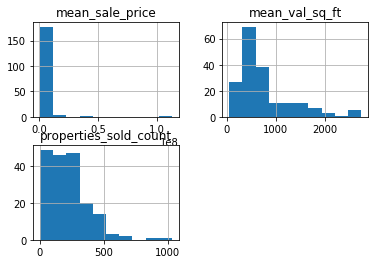


```python
df_group.reset_index(level=0, inplace=True)
df_group.reset_index(level=0, inplace=True)
```


```python
df_group.index
```


    RangeIndex(start=0, stop=183, step=1)


```python
boro_dict = {1 : 'MANHATTAN',
2 : 'BRONX',
3 : 'BROOKLYN',
4 : 'QUEENS',
5 : 'STATEN ISLAND'}
```


```python
for n in range (1,6):
    plt.figure(figsize=(50,20))
    plt.suptitle("Mean Value Per Sq Foot by Zip Code: "+boro_dict[n], y = .9, fontsize = 50, va = 'baseline')
    sns.set(font_scale=4) 
#     plt.xticks(rotation = 45)
    df_group.mean_val_sq_ft[df_group.BOROUGH == n].hist()
```


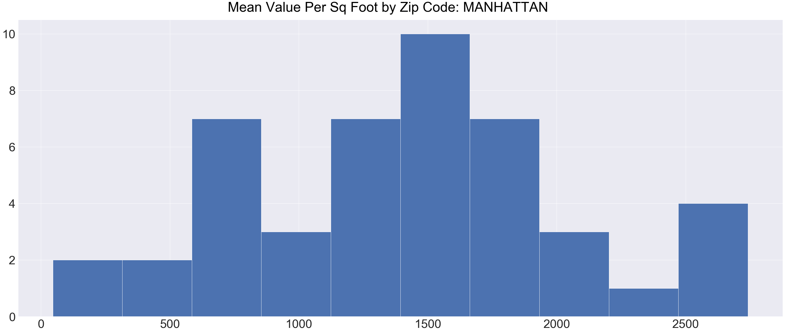


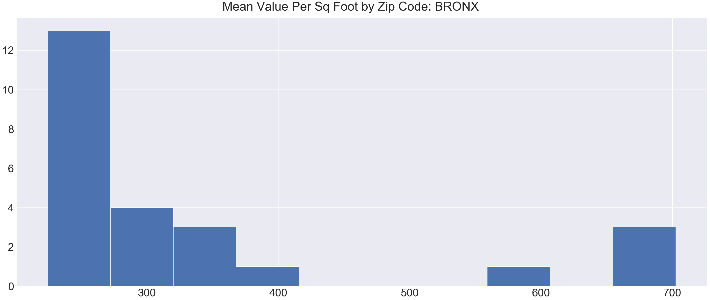


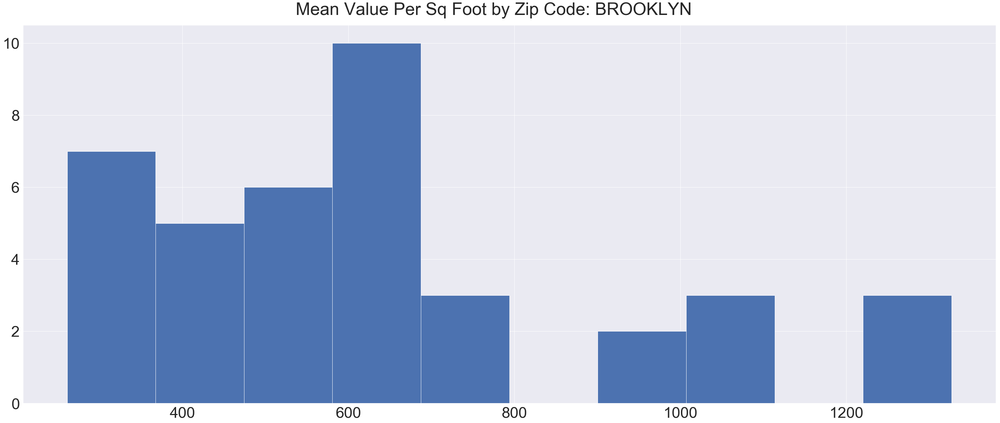


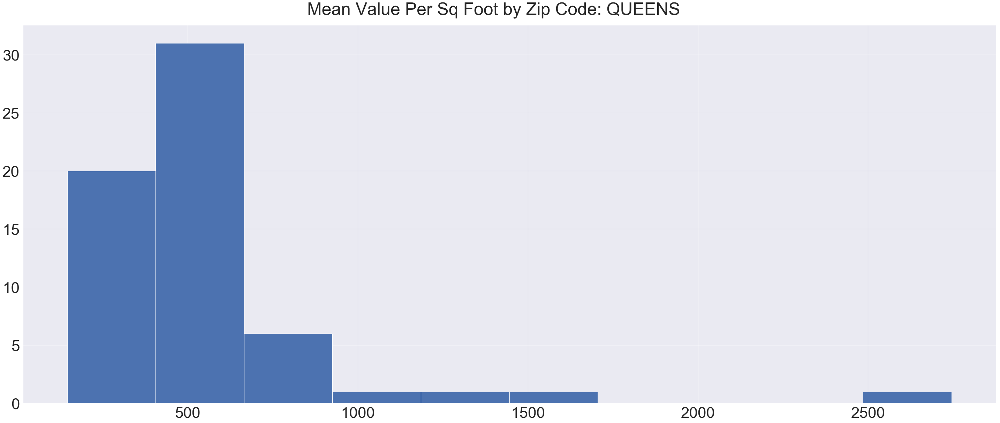


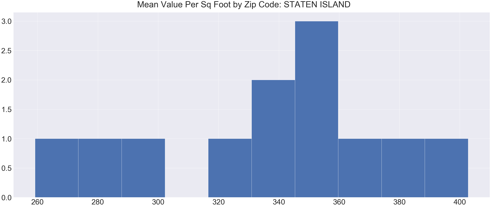


```python
df_group.sort_values('mean_val_sq_ft').head() #
```


<div>
<style scoped>
    .dataframe tbody tr th:only-of-type {
        vertical-align: middle;
    }

    .dataframe tbody tr th {
        vertical-align: top;
    }

    .dataframe thead th {
        text-align: right;
    }
</style>
<table border="1" class="dataframe">
  <thead>
    <tr style="text-align: right;">
      <th></th>
      <th>BOROUGH</th>
      <th>Postcode</th>
      <th>properties_sold_count</th>
      <th>mean_sale_price</th>
      <th>mean_val_sq_ft</th>
    </tr>
  </thead>
  <tbody>
    <tr>
      <th>41</th>
      <td>1.0</td>
      <td>10105.0</td>
      <td>1</td>
      <td>7.500000e+05</td>
      <td>46.239211</td>
    </tr>
    <tr>
      <th>173</th>
      <td>4.0</td>
      <td>11430.0</td>
      <td>1</td>
      <td>3.670000e+05</td>
      <td>145.634921</td>
    </tr>
    <tr>
      <th>60</th>
      <td>2.0</td>
      <td>10454.0</td>
      <td>52</td>
      <td>1.104823e+06</td>
      <td>224.521463</td>
    </tr>
    <tr>
      <th>65</th>
      <td>2.0</td>
      <td>10459.0</td>
      <td>97</td>
      <td>9.850914e+05</td>
      <td>227.442580</td>
    </tr>
    <tr>
      <th>79</th>
      <td>2.0</td>
      <td>10472.0</td>
      <td>215</td>
      <td>8.012885e+05</td>
      <td>233.671915</td>
    </tr>
  </tbody>
</table>
</div>


```python
df_group.sort_values('mean_val_sq_ft',ascending= False).head()
```


<div>
<style scoped>
    .dataframe tbody tr th:only-of-type {
        vertical-align: middle;
    }

    .dataframe tbody tr th {
        vertical-align: top;
    }

    .dataframe thead th {
        text-align: right;
    }
</style>
<table border="1" class="dataframe">
  <thead>
    <tr style="text-align: right;">
      <th></th>
      <th>BOROUGH</th>
      <th>Postcode</th>
      <th>properties_sold_count</th>
      <th>mean_sale_price</th>
      <th>mean_val_sq_ft</th>
    </tr>
  </thead>
  <tbody>
    <tr>
      <th>174</th>
      <td>4.0</td>
      <td>11432.0</td>
      <td>231</td>
      <td>1.447801e+06</td>
      <td>2745.436418</td>
    </tr>
    <tr>
      <th>11</th>
      <td>1.0</td>
      <td>10013.0</td>
      <td>302</td>
      <td>9.111489e+06</td>
      <td>2741.005547</td>
    </tr>
    <tr>
      <th>10</th>
      <td>1.0</td>
      <td>10012.0</td>
      <td>112</td>
      <td>8.006836e+06</td>
      <td>2639.036598</td>
    </tr>
    <tr>
      <th>12</th>
      <td>1.0</td>
      <td>10014.0</td>
      <td>207</td>
      <td>6.661160e+06</td>
      <td>2630.385548</td>
    </tr>
    <tr>
      <th>18</th>
      <td>1.0</td>
      <td>10022.0</td>
      <td>270</td>
      <td>1.136569e+07</td>
      <td>2563.290996</td>
    </tr>
  </tbody>
</table>
</div>


```python
df_group.sort_values('properties_sold_count', ascending= False).head()
```


<div>
<style scoped>
    .dataframe tbody tr th:only-of-type {
        vertical-align: middle;
    }

    .dataframe tbody tr th {
        vertical-align: top;
    }

    .dataframe thead th {
        text-align: right;
    }
</style>
<table border="1" class="dataframe">
  <thead>
    <tr style="text-align: right;">
      <th></th>
      <th>BOROUGH</th>
      <th>Postcode</th>
      <th>properties_sold_count</th>
      <th>mean_sale_price</th>
      <th>mean_val_sq_ft</th>
    </tr>
  </thead>
  <tbody>
    <tr>
      <th>56</th>
      <td>5.0</td>
      <td>10314.0</td>
      <td>1033</td>
      <td>544467.371733</td>
      <td>358.007936</td>
    </tr>
    <tr>
      <th>55</th>
      <td>5.0</td>
      <td>10312.0</td>
      <td>866</td>
      <td>602394.333718</td>
      <td>350.964309</td>
    </tr>
    <tr>
      <th>50</th>
      <td>5.0</td>
      <td>10306.0</td>
      <td>704</td>
      <td>575589.346591</td>
      <td>384.898003</td>
    </tr>
    <tr>
      <th>125</th>
      <td>3.0</td>
      <td>11234.0</td>
      <td>660</td>
      <td>731914.248485</td>
      <td>449.221191</td>
    </tr>
    <tr>
      <th>176</th>
      <td>4.0</td>
      <td>11434.0</td>
      <td>594</td>
      <td>554835.994949</td>
      <td>353.085124</td>
    </tr>
  </tbody>
</table>
</div>


```python
df_group.loc[df_group.Postcode == 11238] #looking at my neighborhood
```


<div>
<style scoped>
    .dataframe tbody tr th:only-of-type {
        vertical-align: middle;
    }

    .dataframe tbody tr th {
        vertical-align: top;
    }

    .dataframe thead th {
        text-align: right;
    }
</style>
<table border="1" class="dataframe">
  <thead>
    <tr style="text-align: right;">
      <th></th>
      <th>BOROUGH</th>
      <th>Postcode</th>
      <th>properties_sold_count</th>
      <th>mean_sale_price</th>
      <th>mean_val_sq_ft</th>
    </tr>
  </thead>
  <tbody>
    <tr>
      <th>129</th>
      <td>3.0</td>
      <td>11238.0</td>
      <td>358</td>
      <td>1.834370e+06</td>
      <td>1006.140389</td>
    </tr>
  </tbody>
</table>
</div>


# C. Second Data Set -  Active School Projects Under Construction

The Department of Education’s [Active Projects Under Construction](https://data.cityofnewyork.us/Housing-Development/Active-Projects-Under-Construction/8586-3zfm) lists new school projects (Capacity) and Capital Improvement Projects (CIP) currently under construction. The file includes the following data:

    - School Name;
    - Borough;
    - Construction Award;
    - Postcode;
    - Project type


### 1. Load and clean the School data


```python
school = pd.read_csv('Active_Projects_Under_Construction.csv')
```


```python
school.head()
```


<div>
<style scoped>
    .dataframe tbody tr th:only-of-type {
        vertical-align: middle;
    }

    .dataframe tbody tr th {
        vertical-align: top;
    }

    .dataframe thead th {
        text-align: right;
    }
</style>
<table border="1" class="dataframe">
  <thead>
    <tr style="text-align: right;">
      <th></th>
      <th>School Name</th>
      <th>BoroughCode</th>
      <th>Geographical District</th>
      <th>Project Description</th>
      <th>Construction Award</th>
      <th>Project type</th>
      <th>Building ID</th>
      <th>Building Address</th>
      <th>City</th>
      <th>Postcode</th>
      <th>...</th>
      <th>Latitude</th>
      <th>Longitude</th>
      <th>Community Board</th>
      <th>Council District</th>
      <th>Census Tract</th>
      <th>BIN</th>
      <th>BBL</th>
      <th>NTA</th>
      <th>Location 1</th>
      <th>Data As Of</th>
    </tr>
  </thead>
  <tbody>
    <tr>
      <th>0</th>
      <td>P.S. 101 - BROOKLYN</td>
      <td>K</td>
      <td>21</td>
      <td>Addition</td>
      <td>65999000.0</td>
      <td>CAP</td>
      <td>K101</td>
      <td>2360 BENSON AVENUE</td>
      <td>Brooklyn</td>
      <td>11214.0</td>
      <td>...</td>
      <td>40.597863</td>
      <td>-73.991693</td>
      <td>11.0</td>
      <td>47.0</td>
      <td>302.0</td>
      <td>3185973.0</td>
      <td>3.068750e+09</td>
      <td>Bensonhurst East                              ...</td>
      <td>(40.597863, -73.991693)</td>
      <td>NaN</td>
    </tr>
    <tr>
      <th>1</th>
      <td>P.S./I.S. 338 - BROOKLYN</td>
      <td>K</td>
      <td>22</td>
      <td>Demo</td>
      <td>739309.0</td>
      <td>CAP</td>
      <td>K338</td>
      <td>510 CONEY ISLAND AVE</td>
      <td>Brooklyn</td>
      <td>11218.0</td>
      <td>...</td>
      <td>40.645199</td>
      <td>-73.970520</td>
      <td>12.0</td>
      <td>40.0</td>
      <td>492.0</td>
      <td>3124797.0</td>
      <td>3.053420e+09</td>
      <td>Kensington-Ocean Parkway                      ...</td>
      <td>(40.645199, -73.97052)</td>
      <td>NaN</td>
    </tr>
    <tr>
      <th>2</th>
      <td>P.S./I.S. 338 - BROOKLYN</td>
      <td>K</td>
      <td>22</td>
      <td>New</td>
      <td>67683691.0</td>
      <td>CAP</td>
      <td>K338</td>
      <td>510 CONEY ISLAND AVE</td>
      <td>Brooklyn</td>
      <td>11218.0</td>
      <td>...</td>
      <td>40.645199</td>
      <td>-73.970520</td>
      <td>12.0</td>
      <td>40.0</td>
      <td>492.0</td>
      <td>3124797.0</td>
      <td>3.053420e+09</td>
      <td>Kensington-Ocean Parkway                      ...</td>
      <td>(40.645199, -73.97052)</td>
      <td>NaN</td>
    </tr>
    <tr>
      <th>3</th>
      <td>PRE-K CENTER @ 369 93RD STREET - BROOKLYN</td>
      <td>K</td>
      <td>20</td>
      <td>New</td>
      <td>27637000.0</td>
      <td>CAP</td>
      <td>K613</td>
      <td>369 93RD STREET</td>
      <td>Brooklyn</td>
      <td>11209.0</td>
      <td>...</td>
      <td>40.618041</td>
      <td>-74.031381</td>
      <td>10.0</td>
      <td>43.0</td>
      <td>58.0</td>
      <td>3155119.0</td>
      <td>3.061030e+09</td>
      <td>Bay Ridge                                     ...</td>
      <td>(40.618041, -74.031381)</td>
      <td>NaN</td>
    </tr>
    <tr>
      <th>4</th>
      <td>PRE-K CENTER @ 219 25TH STREET - BROOKLYN</td>
      <td>K</td>
      <td>15</td>
      <td>Lease</td>
      <td>8464400.0</td>
      <td>CAP</td>
      <td>K661</td>
      <td>219 25TH STREET</td>
      <td>Brooklyn</td>
      <td>11232.0</td>
      <td>...</td>
      <td>40.659882</td>
      <td>-73.997016</td>
      <td>7.0</td>
      <td>38.0</td>
      <td>101.0</td>
      <td>3336859.0</td>
      <td>3.006520e+09</td>
      <td>Sunset Park West                              ...</td>
      <td>(40.659882, -73.997016)</td>
      <td>NaN</td>
    </tr>
  </tbody>
</table>
<p>5 rows × 21 columns</p>
</div>


```python
school.shape
```


    (2227, 21)


```python
school.describe(include = 'all')
```


<div>
<style scoped>
    .dataframe tbody tr th:only-of-type {
        vertical-align: middle;
    }

    .dataframe tbody tr th {
        vertical-align: top;
    }

    .dataframe thead th {
        text-align: right;
    }
</style>
<table border="1" class="dataframe">
  <thead>
    <tr style="text-align: right;">
      <th></th>
      <th>School Name</th>
      <th>BoroughCode</th>
      <th>Geographical District</th>
      <th>Project Description</th>
      <th>Construction Award</th>
      <th>Project type</th>
      <th>Building ID</th>
      <th>Building Address</th>
      <th>City</th>
      <th>Postcode</th>
      <th>...</th>
      <th>Latitude</th>
      <th>Longitude</th>
      <th>Community Board</th>
      <th>Council District</th>
      <th>Census Tract</th>
      <th>BIN</th>
      <th>BBL</th>
      <th>NTA</th>
      <th>Location 1</th>
      <th>Data As Of</th>
    </tr>
  </thead>
  <tbody>
    <tr>
      <th>count</th>
      <td>2224</td>
      <td>2227</td>
      <td>2227.000000</td>
      <td>2224</td>
      <td>2.227000e+03</td>
      <td>2227</td>
      <td>2227</td>
      <td>2227</td>
      <td>2227</td>
      <td>2222.000000</td>
      <td>...</td>
      <td>2219.000000</td>
      <td>2219.000000</td>
      <td>2219.000000</td>
      <td>2219.000000</td>
      <td>2219.000000</td>
      <td>2.209000e+03</td>
      <td>2.209000e+03</td>
      <td>2219</td>
      <td>2219</td>
      <td>1871</td>
    </tr>
    <tr>
      <th>unique</th>
      <td>718</td>
      <td>5</td>
      <td>NaN</td>
      <td>534</td>
      <td>NaN</td>
      <td>2</td>
      <td>670</td>
      <td>665</td>
      <td>6</td>
      <td>NaN</td>
      <td>...</td>
      <td>NaN</td>
      <td>NaN</td>
      <td>NaN</td>
      <td>NaN</td>
      <td>NaN</td>
      <td>NaN</td>
      <td>NaN</td>
      <td>330</td>
      <td>661</td>
      <td>4</td>
    </tr>
    <tr>
      <th>top</th>
      <td>THE BROOKLYN SCHOOL FOR SOCIAL</td>
      <td>K</td>
      <td>NaN</td>
      <td>Addition</td>
      <td>NaN</td>
      <td>CIP</td>
      <td>K480</td>
      <td>400 IRVING AVENUE</td>
      <td>Brooklyn</td>
      <td>NaN</td>
      <td>...</td>
      <td>NaN</td>
      <td>NaN</td>
      <td>NaN</td>
      <td>NaN</td>
      <td>NaN</td>
      <td>NaN</td>
      <td>NaN</td>
      <td>Upper West Side</td>
      <td>(40.69697, -73.910791)</td>
      <td>02/06/2019</td>
    </tr>
    <tr>
      <th>freq</th>
      <td>13</td>
      <td>669</td>
      <td>NaN</td>
      <td>109</td>
      <td>NaN</td>
      <td>1981</td>
      <td>18</td>
      <td>18</td>
      <td>669</td>
      <td>NaN</td>
      <td>...</td>
      <td>NaN</td>
      <td>NaN</td>
      <td>NaN</td>
      <td>NaN</td>
      <td>NaN</td>
      <td>NaN</td>
      <td>NaN</td>
      <td>24</td>
      <td>18</td>
      <td>531</td>
    </tr>
    <tr>
      <th>mean</th>
      <td>NaN</td>
      <td>NaN</td>
      <td>18.886843</td>
      <td>NaN</td>
      <td>7.236379e+06</td>
      <td>NaN</td>
      <td>NaN</td>
      <td>NaN</td>
      <td>NaN</td>
      <td>10881.021152</td>
      <td>...</td>
      <td>40.722894</td>
      <td>-73.918658</td>
      <td>7.642181</td>
      <td>22.012618</td>
      <td>9637.741325</td>
      <td>3.033953e+06</td>
      <td>2.959603e+09</td>
      <td>NaN</td>
      <td>NaN</td>
      <td>NaN</td>
    </tr>
    <tr>
      <th>std</th>
      <td>NaN</td>
      <td>NaN</td>
      <td>12.451153</td>
      <td>NaN</td>
      <td>1.362528e+07</td>
      <td>NaN</td>
      <td>NaN</td>
      <td>NaN</td>
      <td>NaN</td>
      <td>531.346394</td>
      <td>...</td>
      <td>0.089324</td>
      <td>0.093483</td>
      <td>4.478377</td>
      <td>14.998913</td>
      <td>27116.398357</td>
      <td>1.217034e+06</td>
      <td>1.180007e+09</td>
      <td>NaN</td>
      <td>NaN</td>
      <td>NaN</td>
    </tr>
    <tr>
      <th>min</th>
      <td>NaN</td>
      <td>NaN</td>
      <td>1.000000</td>
      <td>NaN</td>
      <td>0.000000e+00</td>
      <td>NaN</td>
      <td>NaN</td>
      <td>NaN</td>
      <td>NaN</td>
      <td>10002.000000</td>
      <td>...</td>
      <td>40.508284</td>
      <td>-74.244118</td>
      <td>1.000000</td>
      <td>1.000000</td>
      <td>1.000000</td>
      <td>1.001388e+06</td>
      <td>1.001130e+09</td>
      <td>NaN</td>
      <td>NaN</td>
      <td>NaN</td>
    </tr>
    <tr>
      <th>25%</th>
      <td>NaN</td>
      <td>NaN</td>
      <td>10.000000</td>
      <td>NaN</td>
      <td>5.794400e+05</td>
      <td>NaN</td>
      <td>NaN</td>
      <td>NaN</td>
      <td>NaN</td>
      <td>10455.000000</td>
      <td>...</td>
      <td>40.658295</td>
      <td>-73.975393</td>
      <td>4.000000</td>
      <td>9.000000</td>
      <td>167.000000</td>
      <td>2.019463e+06</td>
      <td>2.031720e+09</td>
      <td>NaN</td>
      <td>NaN</td>
      <td>NaN</td>
    </tr>
    <tr>
      <th>50%</th>
      <td>NaN</td>
      <td>NaN</td>
      <td>19.000000</td>
      <td>NaN</td>
      <td>2.777000e+06</td>
      <td>NaN</td>
      <td>NaN</td>
      <td>NaN</td>
      <td>NaN</td>
      <td>11209.000000</td>
      <td>...</td>
      <td>40.720713</td>
      <td>-73.916070</td>
      <td>7.000000</td>
      <td>19.000000</td>
      <td>359.000000</td>
      <td>3.113388e+06</td>
      <td>3.039690e+09</td>
      <td>NaN</td>
      <td>NaN</td>
      <td>NaN</td>
    </tr>
    <tr>
      <th>75%</th>
      <td>NaN</td>
      <td>NaN</td>
      <td>27.000000</td>
      <td>NaN</td>
      <td>7.609000e+06</td>
      <td>NaN</td>
      <td>NaN</td>
      <td>NaN</td>
      <td>NaN</td>
      <td>11355.000000</td>
      <td>...</td>
      <td>40.793729</td>
      <td>-73.861230</td>
      <td>11.000000</td>
      <td>35.000000</td>
      <td>964.000000</td>
      <td>4.134578e+06</td>
      <td>4.040890e+09</td>
      <td>NaN</td>
      <td>NaN</td>
      <td>NaN</td>
    </tr>
    <tr>
      <th>max</th>
      <td>NaN</td>
      <td>NaN</td>
      <td>84.000000</td>
      <td>NaN</td>
      <td>9.882000e+07</td>
      <td>NaN</td>
      <td>NaN</td>
      <td>NaN</td>
      <td>NaN</td>
      <td>11694.000000</td>
      <td>...</td>
      <td>40.903553</td>
      <td>-73.709137</td>
      <td>18.000000</td>
      <td>51.000000</td>
      <td>157903.000000</td>
      <td>5.164530e+06</td>
      <td>5.078980e+09</td>
      <td>NaN</td>
      <td>NaN</td>
      <td>NaN</td>
    </tr>
  </tbody>
</table>
<p>11 rows × 21 columns</p>
</div>


```python
school.isnull().sum()
```


    School Name                3
    BoroughCode                0
    Geographical District      0
    Project Description        3
    Construction Award         0
    Project type               0
    Building ID                0
    Building Address           0
    City                       0
    Postcode                   5
    Borough                    8
    Latitude                   8
    Longitude                  8
    Community Board            8
    Council District           8
    Census Tract               8
    BIN                       18
    BBL                       18
    NTA                        8
    Location 1                 8
    Data As Of               356
    dtype: int64


### 2. Fill in missing zip codes

- Since only 2 addresses corresponded to the missing zips, just googled the school addresses and filled in the missing values


```python
np.sum(school['Postcode'] == 0)
```


    0


```python
mask2 = school['Postcode'].isnull()
```


```python
missing_zips2 = list(school[school['Postcode'].isnull()]['Building Address'])
missing_zips2
```


    ['227 WEST 27TH STREET',
     '227 WEST 27TH STREET',
     '227 WEST 27TH STREET',
     '1000 EAST TREMONT AVENUE',
     '1000 EAST TREMONT AVENUE']


```python
# googled 2 addresses corresponding to the 5 missing zip codes and created a dictionary to update zips
zip_dict2 = {'227 WEST 27TH STREET': 10001, '1000 EAST TREMONT AVENUE': 10460}
```


```python
school.loc[mask2,'Postcode'] = school.loc[mask2, 'Building Address'].map(zip_dict2)
```


```python
school.isnull().sum() #double check no more zip null vals
```


    School Name                3
    BoroughCode                0
    Geographical District      0
    Project Description        3
    Construction Award         0
    Project type               0
    Building ID                0
    Building Address           0
    City                       0
    Postcode                   0
    Borough                    8
    Latitude                   8
    Longitude                  8
    Community Board            8
    Council District           8
    Census Tract               8
    BIN                       18
    BBL                       18
    NTA                        8
    Location 1                 8
    Data As Of               356
    dtype: int64


```python
unique_desc = school['Project Description'].unique() #too many descriptions to try to bucket
len(unique_desc),unique_desc
```


    (535, array(['Addition', 'Demo', 'New', 'Lease', 'Interior', nan,
            'PLANYC BOILER CNVRSN/PLANYC CLIMATE CTRL',
            'WATER PENETRATION/PLANYC BOILER/PLANYC CLIMATE',
            'SANDY - INSTALL TEMPORARY BOILERS',
            'FY16 RESO A PLAYGROUND REDVELOPMENT',
            'ROOFS/PARAPETS/EXT MASONRY/EXT DOORS',
            'FULL PROGRAM ACCESSIBILITY/LOW VOLTAGE ELECTRICAL',
            'FY13 RESO A PLAYGROUND REDEVELOPMENT',
            'EXTERIOR MASONRY/PARAPETS', 'KITCHEN FLOORING/FLOOD/ANSUL SYSTEM',
            'PLANYC BOILER/PLANYC CLIMATE CTRL/FIRE ALARM',
            'AUDITORIUM UPGRADE',
            'PARAPETS/FLOOD ELIMINATION/ROOFS/MASONRY/GYM UPG',
            'PUBLIC ADDRESS SYSTEM REPLACEMENT',
            'EXT MASONRY/FLOOD ELIMINATION/PARAPETS/ROOFS',
            'LOW VOLTAGE ELEC SYSTEM/ANSUL SYSTEM',
            'PLAYNYC BOILER CONVERSION/CLIMATE CONTROL',
            'PARAPET/ROOFS/EXT MASONRY',
            'WATER INFILTRATION/FLOOD/PARAPETS/ROOFS',
            'FY 15 RESO A ROOM CONVERSION', 'SCIENCE LAB UPGRADES',
            'EXTERIOR MASONRY', 'EXTERIOR MASONRY/PARAPETS/ROOFS',
            'WATER PENETRATION THROUGH EXTERIOR/PARAPETS/ROOFS',
            'RPZ VALVES/LOW VOLTAGE ELEC SYSTEM',
            'FY16 RESO A GYMNASIUM UPGRADE', 'LIGHTING REPLACEMENT (DCAS)',
            'TCU REMOVAL & PLAYGROUND REDEVELOPMENT',
            'EXTERIOR MASONRY/FLOOD ELMNTN/PARAPETS',
            'FY16 RESO A AUDITORIUM UPGRADE',
            'SANDY:INT/HEATING/ELEC/FLOOD/CLIMATE/VENT/FA',
            'DETERIORATED WINDOW WELL WALLS/FLOOD/PARAPETS/ROOF',
            'MASONRY/WINDOWS/ROOFS/PARAPETS', 'SANDY- TEMP BOILER',
            'FY16 RESO A LIBRARY UPGRADE', 'PLAYGROUND REDEVELOPMENT AND TCU',
            'PARAPETS/EXT MASONRY/CONCRETE/FLOOD/ROOF',
            'CRACKED MASONRY, DETERIORATED MORTAR/FLOOD/WINDOWS',
            'INTERIOR SPACES/HEATING PLT/ELEC/CLIMATE/FLOOD EL',
            'FLOOD ELMNTN/ROOFS/EXTERIOR MASONRY/PARAPETS',
            'PLAYGROUND REDEVELOPMENT & TCU',
            'SANDY:INTERIOR/CONCRETE/HEAT/ELEC/FLOOD/FA', 'STRUCTURAL DEFECTS',
            'MORTAR JOINTS DETERIOR /FLOOD/PARAPETS/ROOF/WINDOW',
            'FY16 RESO A AUDITORIUM UPGRAD',
            'FY16 RESO A ROOM CONVERSIONS/PARTITIONING',
            'PLANYC BOILER CONVERSION/CLIMATE CONTROL',
            'SANDY - HEATING/ELEC SYS/FLOOD ELIM/CLIMATE CONTRL',
            'CRACKED EXTERIOR MASONRY/ROOFS/PARAPETS',
            'PLAYGROUND REDEVELOPMENT AND TCU REMOVAL',
            'SANDY:INTERIOR/HEAT/ELEC/FLOOD/ELEVATOR/HVAC/FA',
            'SANDY:ELEVATOR UPG/FLOOD/FIRE ALARM',
            'INTERIOR SPACES/HEATING/ELEC/FLOOD/CLIMATE',
            'DAMAGED EXTERIOR MASONRY/PARAPETS/ROOF',
            'TCU REMOVAL/PLAYGROUND REDEVELOPMENT',
            'CRACKED EXT MASONRY/ROOFS/PARAPETS',
            'RENOVATION OF CLASSROOM 332', 'FY14 RESO A LIBRARY UPGRADE',
            'FULL PROGRAM ACCESSIBILITY/FIRE ALARM', 'LL 41-16 COMPLIANCE',
            'LIBRARY UPGRADE', 'ELECTRICAL LIGHTING FIXTURES',
            'SANDY:INT/HEAT/FLOOD/PIPING/NON-SANDY:PIPING/FLOOD',
            'CRACKED CONCRETE STRUCTURE/FIELD HOUSE',
            'SANDY: INTERIOR/VENT/ELEC/FLOOD/ATHLETIC FIELD',
            'LOW VOLT ELEC SYS/KITCHEN FIRE SUPRESSION SYS',
            'FY14 RESO A GYMNASIUM UPGRADE',
            'MASONRY/WINDOWS/PARAPETS/ROOFS/FLOOD ELIMINAITON',
            'ATHLETIC FIELD REPAIRS', 'FY15 RESO A ELECTRICAL SYSTEMS',
            'SCHOOL BASED HEALTH CENTER', 'FY14 RESO A AUDITORIUM UPGRADE',
            'PARAPETS/EXTERIOR MASONRY/ROOFS/FLOOD ELIMINATION',
            'FAILING COPING STONE/ROOFS', 'ROOFS/WINDOWS/PARAPETS/EXT MASONRY',
            'ANSUL SYS/FIRE ALARM/MECHANICAL SYS - VENTILATION',
            'DAMAGED EXTERIOR WALLS/ROOFS',
            'MASONRY/PIPING/DOOR/FLOOD/WIN/PARAPETS/ROOF/HVAC',
            'RPZ VALVES/LOW VOLTAGE ELECTRICAL/ANSUL SYSTEM',
            'FIRE ALARM SYSTEM/SMOKE DAMPERS', 'PARAPETS/ROOFS/WINDOWS',
            'SCIENCE LAB ACID WASTE LINES',
            'FY13 RESO A ROOM CONVERSIONS / PART',
            'MASONRY/AUD UPG/WIN/FLOOD/PARAPETS/ROOFS/FA',
            'FY16 RESO A ROOFTOP PLAYGROUND',
            'PARAPETS/WINDOWS/EXTERIOR MASONRY',
            'MASONRY & GRANITE STEP DEFECTS',
            'FIFTH FLOOR CEILING REPLACEMENT',
            'RPZ VALVES/LOW VOLT/ELEC UPGRADE',
            'PARAPETS/ROOFS/FLOOD ELIMINATION/EXTERIOR MASONRY',
            'PARAPETS/MASONRY/RM UPG/FLOOD/ROOF/PLAYGROUND',
            'SCIENCE LAB UPGRADE', 'TEMPORARY BOILER',
            'NON-SANDY:MASONRY/ROOF/PARAPET/SANDY:FLOOD/MASONRY',
            'DEFECTIVE CONCRETE BEAM FIRE PROOFING',
            'PLANYC BOILER/PLANC CLIMATE CTRL/LOW VOLT/KITCHEN',
            'FLOOD ELIMINATION', 'PLANYC BOILER CONVERSION/CIMATE CONTROL',
            'EXTERIOR MASONRY/ROOFS/PARAPETS',
            'PLANYC BOILER CNVSN/PLANYC CLIMATE CTRL',
            'STRUCTURAL DEFICIENCIES', 'FIRE ALARM',
            'MASONRY/FLOOD ELIMINATION/ROOFS/WINDOWS/PARAPETS',
            'EXT MASONRY/ROOFS',
            'FACADE DAMAGE/SITE WORK/FLOOD/PARAPETS/WINDOWS',
            'FY15 RESO A SCIENCE LAB UPGRADES',
            'EXTERIOR MASONRY/FLOOD ELIMINATION/ PARAPETS/ROOFS',
            'FUEL OIL TANK REPLACEMENT',
            'WINDOWS/PARAPETS/FLOOD/EXT MASONRY/ROOFS',
            'FIRE ALARM/VENTILATION', 'ELECTRICAL SYSTEMS/PA SYSTEM',
            'WATER STORAGE TANK',
            'EXT. MASONRY/ROOF/PARAPET/ FLOOD ELIM./WINDOWS/GYM',
            'FY11 RESO A ROOFS',
            'C OF O/C OF O VENT/WATER PLANT/BOILER/ENERGY MGMT',
            'LIGHTING REPLACEMENT', 'ACCESSIBILITY',
            'LOW VOLTAGE ELECTRICAL SYSTEM/ANSUL SYSTEM',
            'PLANYC BOILERS CONVERSION/CLIMATE CONTROL',
            'REINFORCE CINDER/FLOORS/ACCESSIBLITY/ELEC UPG/FA',
            'FY16 RESO A PLAYGROUND UPGRADE', 'FY15 RESO A ACCESSIBILITY',
            'HVAC/PUBLIC ADDRESS SYSTEM',
            'BOILER REPLACE/ELEC SWITCH UPG/PLANYC CLIMATE CTRL',
            'ROOFS/PARAPETS/EXT MASONRY', 'TOILETS-STUDENT',
            'WATER PENETRATION/EXT MASONRY/ROOFS',
            'FY15 RESO A LOW-VOLTAGE ELECTRICAL SYSTEM',
            'DEFECTIVE PARAPET WALL/ROOFS/EXT MASONRY',
            'FY15 RESO A AUDITORIUM UPGRADE',
            'ROOF REPAIR/PARAPETS/EXTERIOR MASONRY',
            'SANDY:INT/HEATING/FLOOD/CLIMATE/PIPING/HVAC/ELEC',
            'SANDY- ELEVATOR REPAIR',
            'SANDY-INTERIOR/HEATING/FLOOD/SHINGLE ROOF/CLIMATE',
            'WATER PENETRATION/EXT MASONRY/PARAPETS/ROOFS',
            'FY16 RESO A AUDITORIUM', 'LOW VOLT ELECTRICAL SYSTEMS',
            'RPZ VALVE', 'RPZ VALVES/LOW VOLTAGE/ELECTRICAL UPG',
            'WATER PENETRATION', 'ADA UPGRADE',
            'SANDY:HEATING/ELEC/FLOOD/AUD/PIPING/HVAC/INT/PAVED',
            'SANDY:INT/HEATING/ELEC/FLOOD/CLIM/PLAYGRND/PIPING',
            'EXT MASONRY/ROOFS/CONCRETE ROOF DECK/PARAPETS',
            'FY16 RESO A PLAYGROUND REDEVELOPMENT', 'WATER PENETRATION/ROOFS',
            'WATER INFILTRATION/ROOFS/PARAPETS/EXT MASONRY',
            'FY16 RESO A ROOM CONVERSIONS / PART',
            'CHIMNEY/ROOFS/PARAPETS/FLOOD',
            'PARAPET/FLOOD ELIMINATION/EXT MASONRY/ROOFING',
            'FY16 RESO A ROOM CONV/FY16 RESO A SCIENCE LAB UPG',
            'PLANYC BOILER CONVERSION/PLANYC CLIMATE CONTROL',
            'SANDY:AC/FLOOD/ELEC/HEAT/INTER/NON-SANDY:CLIM CTRL',
            'FLOORS & WALLS/ROOFS/PARAPETS/EXT MASONRY/FLOOD',
            'FY14 RESO A ROOM CONVERSIONS/PART',
            'FY15 RESO A ROOM CONVERSIONS/PARITTIONING',
            'FY12 RESO A AUDITORIUM UPGRADE', 'NEW A/C CHILLERS',
            'REINFORCING/HEATING PLT/ELEC/FLOOD ELIM/CLIMATE CO',
            'PARAPETS/FLOOD/EXT MASONRY/ROOFS',
            'FY15 RESO A SCIENCE LAB UPGRADE', 'WINDOWS/EXT MASONRY/PARAPETS',
            'SANDY: HEAT/FLOOD/ELEC/INTERIOR/NON-SANDY: CLIMATE',
            'PUBLIC ADDRESS SYSTEM',
            'TCU REMOVAL AND PLAYGROUND REDEVELOPMENT',
            'FLOOD ELIMINATION/ROOFING',
            'DEFECTIVE PARAPETS/EXT MASONRY/ROOFS',
            'RENEWAL SCHOOL BASED HEALTH CENTER',
            'SANDY FIRE ALARM/SANDY PA SYSTEM',
            'SANDY:HEATING/ELEC/FLOOD/CLIMATE/PIPING/INT/GENERA',
            'SANDY REPAIRS-ATHLETIC FIELD',
            'ATHLETIC FIELDS/TCU REMOVAL & PLAYGROUND REDEVELOP',
            'WATER PENETRATION THROUGH FOUNDATION',
            'EXT MASONRY/ROOFS/PAVED AREA-CONCRETE', 'REPAVING PARKING LOT',
            'CONCRETE PAVED AREAS', 'CONCRETE RETAINING WALL',
            'FIRE ALARM SYSTEM/BUILDING MGMT SYSTEM',
            'FUEL FIRE/ROOFS/PARAPETS/MASONRY/FLOOD/GYM UPG/WIN',
            'DEMOLITION & PAVED AREA/TCU REMOVAL PLAYGROUND RED',
            'LL 41/16 COMPLIANCE', 'FY16RESO A LIBRARY UPGRADE',
            'SANDY INTERIOR SPACES/SANDY FLOOD ELIMINATION',
            'EXTERIOR MASONRY/PARAPETS/ROOFS/WINDOWS',
            'PARAPETS/FLOOD/AREAWAY WINDOWS/EXT MASONRY',
            'FY16 RESO A LOW-VOLTAGE ELECTRICAL SYSTEM',
            'FULL PROGRAM ACCESSIBILITY/FIRE ALARM SYSTEM',
            'FY14 RESO A ATHLETIC FIELDS', 'HEATING PLANT/CLIMATE CONTROL',
            'MAIN ELECTRICAL SERVICE/LOW VOLTAGE ELEC SYSTEM',
            'PLAYGROUND REDEVELOPMENT', 'REPAIR-CERTIFICATE OF OCCUPANCY',
            'ROOFS/PARAPETS /EXTERIOR MASONRY/FLOOD ELIMINATION',
            'RETAINING WALL', 'FY16 RESO A PLAYGROUND REDEVELOPMEN',
            'REPAIR-C OF O/SANDY-FLOOD/SAFETY/HEAT/VENT/INT/ELE',
            'BRIDGE & REPAIR WK/PARAPETS/WASTE SYS/WINDOWS/ROOF',
            'FY 16 RESO A WIRING UPGRADE', 'FY16 RESO A ROOM CONVERSIONS',
            'GAS SERVICE', 'PAVED AREAS', 'EXTERIOR MASONRY/WINDOWS/PARAPETS',
            'EXT MASONRY/ROOFS/PARAPETS/WINDOWS/EXT DOORS/FLOOD',
            'RENEWAL SBHC', 'ROOFS/PARAPETS/MASONRY/FLOOD',
            'FULL ACCESSIBILITY', 'EXT MASONRY/ROOFS/PARAPETS',
            'DEFECTIVE RETAINING WALL', 'WINDOW/ROOFS/EXT MASONRY/FLOOD',
            'OIL VAULT & STAIRWAY/PIPING/TOILETS/FLOOD',
            'FUEL OIL TANK LEAKAGE/CLIMATE CTRL',
            'PERMANENT REPAIRS (CEILING TILES)',
            'PARAPET/FLOOD ELIM/EXT MASONRY/ROOFS',
            'ACCESS RAMP & WALL/FLOOD/ROOFS/PARAPETS', 'REPAIR SINK HOLE',
            'FALLING COPING STONES/EXT MASONRY', 'PAVED AREAS-CONCRETE',
            'SEWAGE LEAK/FIRE SYS SPRINKLER/CRACKED CONCRETE/FA',
            'FACADE/ROOFS', 'CERTIFICATE OF OCCUPANCY',
            'SANDY ELEC/HEAT/FLOOD/CLIM/SINK HOLES/PLUMBING',
            'PARAPETS/ROOFS/EXT MASONRY',
            'BOILER/CLIMATE CONTROL/WATER INFILTRATION',
            'FY16 RESO A RETRACTABLE WALL', 'BOILER FOR SWIMMING',
            'ROOFS/PARAPETS/EXT MASONRY/WINDOWS',
            'EXTERIOR MASONRY/FLOOD ELIMINATION/PARAPETS/ROOF',
            'ROOF REPLACEMENT/PARAPETS',
            'EXT MASONRY/SCIENCE LAB UPG/INTERIOR SPACES',
            'DEFECTIVE MASONRY/ROOFS/FLOOD ELIMINATION',
            'FY08 RESO A GYM UPGRADE',
            'ELEVATOR/EXT MASONRY/FLOOD/PARAPETS/ROOFS/WALL',
            'LOW VOLTAGE ELECTRICAL SYSTEMS', 'FULL PROGRAM ACCESSIBILITY',
            'FY13 RESO A SCIENCE LAB UPGRADES',
            'FLOOD ELIMINATION/EXTERIOR MASONRY/WINDOWS', 'ENY DANCE STUDIO',
            'PLANYC BOILER REPLACEMENT/PLANYC CLIMATE CONTROL',
            'FY16 RESO A SCIENCE LAB UPGRADE',
            'WATER INFILTRATION/ROOFS/EXT MASONRY',
            'EXT MASONRY/FLOOD ELIMINATION/ROOFS',
            'SCIENCE LAB UPGRADES/SCIENCE LAB UPGRADES',
            'TCU REMOVAL - PLAYGROUND REDEVELOPMENT',
            'FY17 RESO A VISUAL ART LAB', 'FLOOD/ROOFS/PARAPETS/EXT MASONRY',
            'WATER PENETRATION/FLOOD/PARAPETS/ROOFS',
            'FY17 RESO A AUDITORIUM UPGRADE',
            'FY17 RESO A SCIENCE LAB/FY17 RESO A SCIENCE LAB',
            'EXTERIOR MASONRY/ROOFS',
            'EXTERIOR MASONRY DEFECTS/FLOOD ELIMINATION/PARAPET',
            'ENY LIBRARY UPGRADE', 'ENY AUDITORIUM UPGRADE',
            'EXT MASONRY/ROOFS/CLIMATE CTRL/PARAPETS',
            'EXT MASONRY - WATER PENETRATION/PARAPETS/ROOFS',
            'CRACKED EXTERIOR MASONRY',
            'WINDOWS/FLOOD ELMNTN/ROOFS/FIRE ALARM/HVAC VTLTN',
            'ROOFS/FLOOD/PARAPETS/EXT MASONRY/WINDOWS/LEAD SVC',
            'CRACKED MASONRY/FLOOD/WINDOWS/ROOFS', 'DEFECTIVE STAIR LANDING',
            'EXT MASONRY - WATER PENETRATION/PARAPETS/ROOFS/WIN',
            'EXT MASONRY/FLOOD/WINDOWS/PARAPETS',
            'WATER PENETRATION/EXT MASONRY',
            'WATER INFILTRATION/ROOFS/EXT MASONRY/PARAPETS',
            'MASONRY/CORRODED BEAMS/ROOFS/PARAPETS',
            'TCU REMOVAL AND PLAYGROUND',
            'LOW VOLT/PLANYC CLIMATE CTRL/PLANYC BOILER CONV',
            'FY15 RESO A PLAYGROUND REDEVELOPMENT',
            'PLANYC BOILER CONVERSION/CLIMATE CTRL', 'ROOFS/WINDOWS/PARAPETS',
            'ENY PLAYGROUND UPGRADE', 'ENY SCIENCE LAB UPGRADES',
            'STRUCTURAL DEFECTS/EXT MASONRY', 'FY17 RESO A LIBRARY UPGRADES',
            'PLANYC PLAYGROUND', 'DEFECTIVE GYMNASIUM WALLS/ROOFS/PARAPETS',
            'SWIMMING POOL',
            'WATER PENETRATION INTO BASEMENT/NATATORIUM RECONST',
            'WORK REQUIRED TO OBTAIN A C OF O',
            'DETERIORATED LEADER AND DRAIN LINES', 'POOL BOILER',
            'ATHLETIC FIELD - TRACK', 'FY16 RESO A CULINARY ARTS ROOM',
            'EXT MASONRY/ROOFS/WINDOWS', 'MASONRY/WINDOWS/PARAPETS/ROOFS',
            'GYM & CAFE FLOOR/FLOOD/FLOOR/PARAPETS/MASONRY/ROOF',
            'EXTERIOR MASONRY/FLOOD ELIMINATION',
            'FY14 RESO A PLAYGROUND REDEVELOPMENT',
            'FLOOD ELIMINATION/EXTERIOR MASONRY',
            'TCU REMOVAL / PLAYGROUND REDEVELOPMENT',
            'EXTERIOR MASONRY/ROOFS/PARAPETS/SITE WALLS',
            'LOW VOLTAGE ELECTRICAL SYSTEM',
            'NON-SANDY:MASONRY/ROOF/PARAPET/SANDY FLOOD/MSNRY',
            'INTERIOR STAIRS', 'PLAY YARD SINKHOLE',
            'FY17 RESO A PLAYGROUND REDEVELOPMENT', 'WATER INFILTRATION',
            'FACADE DAMAGE/SITE WORK/FLOOD/PARAPET/WINDOWS/ROOF',
            'PLAY YARD SURFACE DEFECTS', 'FY17 RESO A LIBRARY UPGRADE',
            'WINDOWS/ROOFS/PARAPETS', 'REMOVE OIL TANK - FUEL CONVERSION',
            'ENY AUDITIORIUM UPGRADE',
            'SCIENCE LAB UPGRADE/FIRE ALARM SYSTEMS',
            'EXT MASONRY/FLOOD ELMNTN/PARAPETS/ROOFS', 'SCIENCE LAB',
            'FY15 RESO A SECURITY CAMERAS', '6TH FLOOR EGRESS/FIRE ALARM',
            'EXTERIOR MASONRY/FLASHING',
            'EXT MSNRY/PARAPET/FLOOD/ ACCESSIBILITY/FIRE ALARM',
            'CHIMNEY LINER REPLAC/PLANYC BOILER/CLIMATE/MASONRY',
            'FLOOD/FA/EXT MASONRY/ELEVATOR/PARAPETS/FLOOD',
            'EXTERIOR MASONRY/TCU REMOVAL & PLAYGROUND/FLOOD',
            'SANDY-INTERIOR/HEATING/FLOOD/ SHINGLE ROOF/CLIMATE',
            'FLOOD ELIMINATION/REINFORCING SUPPORT ELEMENTS',
            'WATER PENETRATION/PARAPETS',
            'CONCRETE/FLOOD/PARAPETS/ ROOFS/WINDOWS/C OF O',
            'MASONRY/ROOFS/PARAPETS',
            'FY17 RESO A ROOM CONVERSIONS/PARTITIONING', 'C OF O',
            'SANDY:HEATING/ELEC/FLD/AUD/ PIPING/HVAC/INT/PAVED',
            'FY15RESO A SCIENCE LAB UPGRADES', 'KITCHEN UPGRADE',
            'PARAPETS/EXT MASONRY', 'ROOFS/EXT MASONRY/PARAPETS',
            'REINF SLAB/HEATING PLT/ELEC/FLOOD ELIM/CLIM CTRL',
            'SANDY NEW A/C CHILLERS',
            'BOILER/CLIMATE CTRL/FLOOD/MASONRY/ ROOFS/PARAPETS', 'SOLAR PANEL',
            'LOW VOLTAGE ELECTRICAL/KITCHEN UPGRADE',
            'SANDY: HEAT/FLOOD/ELEC/ INTERIOR/NON-SANDY:CLIMATE',
            'FY17 RESO A ELECTRICAL SYSTEMS',
            'ROOF/PARAPETS/EXT MASONRY/PAVED AREA CONCRETE',
            'SANDY FIRE ALARM/NON SANDY PA SYSTEM',
            'SANDY:HTNG/ELEC/FLD/CLIMATE/ PIPING/INT/GENERATOR',
            'FY15RESO A AUDITORIUM UPGRADE', 'RPZ VALVES',
            'MSNRY/ROOFS/WINDOWS/PARAPETS/NATATORIUM STRUC REPR',
            'STEEL DETERIORATED COLUMS & COLUMN',
            'FUEL FIRE/ROOFS/PARAPETS/MSNRY/ FLOOD/GYM UPG/WIN',
            'ROOF STRUCTURAL DAMAGE/EXTERIOR MASONRY',
            'FY17 RESO A ROOM CONVERSIONS', 'FIRE ALARM SYSTEM REPLACEMENT',
            'PARAPETS/FLOOD/AREAWAY WINDOWS/EXT MASONRY/ROOFS',
            'FY17 RESO A SCIENCE LAB UPGRADES',
            'WATER INFILTRATION/EXT MASONRY/GYM ROOF',
            'FY16 RESO A CAFETERIA/MULTIPURPOSE', 'PARTIAL ACCESSIBILITY',
            'ATHLETIC FIELDS', 'EXT DOORS/EXT MASONRY/WINDOWS/PARAPETS/ROOFS',
            'STH SBHC', 'ELECTRICAL SERVICE UPGRADE',
            'PLANYC BOILER CONVERSION/PLANYC CLIMATE CTRL',
            'DTERIORATED COPING STONES/PAVED AREA CONCRETE/ROOF',
            'HVAC CONTROLS/VENTILATION',
            'DEFECTIVE RETAINING WALL & PAVEMENTS',
            'FY17 RESOA PLAYGROUND REDEVELOPMENT', 'SWITCH GEAR REPLACEMENT',
            'EXT MASONRY/PARAPETS',
            'WATER INFILTRATION/EXT MASONRY/PAVED AREA-BLACKTOP',
            'EXTERIOR MASONRY/FLOOD ELIMINATION/PARAPETS/ROOFS',
            'PROBES-REPAIRS/PARAPETS/ ROOFS/WINDOWS',
            'EXT MASONRY/PARAPETS/ROOFS/SECURITY LIGHTING/FLOOD',
            'DEFECTIVE MASONRY/PARAPETS', 'FLOOD ELIMINATION/ROOFS',
            '5TH SBHC', 'WATER INFILTRATION/PARAPETS',
            'WATER PENETRATION/ROOF/ PARAPET/MASONRY',
            'REPAIR STEPS & VPS/ROOFS/PARTIAL ACCESSIBILITY',
            'CEILING TILE REPLACEMENT', 'PLANYC BOILER/PLANYC CLIMATE CTRL',
            'WINDOWS', 'FY17 RESO A GYMNASIUM UPGRADE',
            'FY15 RESO A LIBRARY UPGRADE', 'PAVED AREAS CONCRETE',
            'TERRA COTTA REPL/FLOOD/ROOFS/WINDOW/INTERIOR SPACE',
            'PARKING AREA LIGHTING/TCU REMOVAL AND PLAYGROUND',
            'EXT MASONRY/FLOOD/PARAPETS/ROOFS',
            'COMPLETION OF PHASE II MERCY COLLEGE',
            'ELEVATOR/EXT MSNRY/FLOOD/ PARAPETS/ROOFS/WALL',
            'STRUCTURAL STABILIZATION', 'ELECTRICAL SYSTEMS',
            'EXT MASONRY/ROOFS/PARAPETS/FLOOD/TCU/IRON FENCE',
            'FY16 RESO A ATHLETIC FIELD UPGRADE',
            'MASONRY DEFECTS/ROOFS/FLOOD/PARAPETS',
            'PLANYC BOILER CONVERSION/PLANYC CLIMATE CTRL/FLOOD',
            'PUBLIC ADDRESS SYS REPLACEMENT/FA SYS REPLACEMENT',
            'PARAPETS/ROOFS/WINDOWS/PLAYGROUND REDEVELOPMENT',
            'RESO A GREENROOF', 'FY17 RESO A GREEN ROOF',
            'FY16 RESO A SUPPLEMENTAL COOLING',
            'BOILER REPLACEMENT/CLIMATE CONTROL/HVAC',
            'RESO A SUPPLEMENTAL COOLING', 'CHILLER REPLACEMENT',
            'TCU REMOVAL/MASONRY/ROOFS/PARAPETS/FLOOD ELIM',
            'ROOFS/FLOOD ELIMINATION/EXT MASONRY/PARAPETS',
            'EXTERIOR MASONRY/FLOOD ELIMINATION/ROOFS/PARAPETS',
            'DAMAGE STONE/PARAPETS/ROOFS/WINDOWS',
            'ATHLETIC FIELD RETAINING WALL', 'FLOOD ELIMINATION/WINDOWS',
            'FY18 RESO A IP SURVEILLANCE CAMERA INSTALLATION',
            'PUBLIC ADDRESS SYSTEM/PROGRAM CLOCK SYSTEM REPLACE',
            'FLOOD ELIMINATION/ROOFS/EXT MASONRY/PARAPETS',
            'BUILDING FAN REPLACEMENT/ELEC UPGRADE', 'LSP VACUUM PUMPS',
            'PLANYC BOILER/PLANYC CLIMATE CONTROL',
            'IP DIGITAL VIDEO SURVEILLANCE SYSTEM',
            'ELECTRICAL WORK FOR A/C INITIATIVE',
            'EXT MASONRY/WINDOWS/FLOOD ELIMINATION',
            'FY17 RESO A SUPPLEMENTAL COOLING',
            'FY18 RESO A ELECTRICAL SYSTEMS',
            'FY18 RESO A AUDITORIUM  UPGRADE',
            'ELECTRICAL SYSTEM UPGRADE/FLOOD ELIMINATION', 'FALLING MASONRY',
            'STAIRS/EXT MASONRY/PARAPETS/ROOF/FLOOD/WATER PNTRN',
            'FY18 RESO A LIBRARY UPGRADES', 'FY18 RESO A SCIENCE LAB UPGRADES',
            'EXT MASONRY/PARAPETS/ROOFS/WINDOWS/FLOOD/PIPING',
            'FLOOD ELIMINATION/PARAPETS/EXTERIOR MASONRY/ROOFS',
            'FY15 RESO A SUPPLEMENTAL COOLING',
            'WATER PENETRATION/ROOFS/EXT MASONRY/PARAPETS',
            'PARAPETS/EXTERIOR MASONRY/ROOFS', 'RESO A ROOFTOP GREENHOUSE',
            'FY18 RESO A AUDITORIUM UPGRADE', 'FY18 RESO A ELECTRICAL SYSTEM',
            'LOW VOLTAGE ELECTRICAL SYSTEM/WATER PENETRATION', 'ROOF',
            'PARTIAL ACESSIBILITY', 'PARTIAL ACCESSIBILITY RAMPS',
            'FY18 RESO A ROOM CONVERSIONS/PARTITIONING',
            'DEFECTIVE EXT WALL/FLOOD ELIMINATION/PARAPETS/ROOF', 'ELEVATOR',
            'PARAPETS/FLOOD ELIMINATION/ROOFS/EXTERIOR MASONRY',
            'EXTERIOR MASONRY/ROOFS/PARAPETS/WINDOWS/PAVED AREA',
            'MASONRY/WINDOWS/PARAPETS/ROOFS/FLOOD ELIMINATION',
            'ROOFS/WINDOWS/EXTERIOR MASONRY/PARAPETS',
            'REPLACE CHILLERS & COOLING TOWERS', 'STRUCTURAL DEFECTS AND ROOF',
            'FY14 RESO A SCIENCE LAB', 'FLOOR TILE REPLACEMENT',
            'C OF O/ELECTRICAL WORK FOR A/C INITIATIVE',
            'INSTALL BACKFLOW PREVENTION DEVICES',
            'FY17 RESO A CULINARY ARTS KITCHEN UPGRADES',
            'EXT MASONRY/ROOFS/PARAPETS/WINDOWS/FLOOD', 'STANDALONE GYM ANNEX',
            'FY18 RESO A GYMNASIUM UPGRADE',
            'EXT MSNRY/LOW VOLT/VENT/ROOFS/WIN/ PARAPETS/FLOOD',
            'EXT MASONRY/WINDOWS/PARAPETS/ROOFS', 'FACADE/WINDOWS',
            'FY17 RESO A IPDVS CAMERA INSTALLATION', 'ROOFS/EXTERIOR MASONRY',
            'WINDOWS/EXT MASONRY/ROOFS/PARAPETS',
            'FY RESO A AUDITORIUM UPGRADE', 'ROOFS',
            'FY17 RESO A SECURITY CAMERAS', 'COLLASPED WALL', 'AC INITIATIVE',
            'FY18 RESO A SAFETY SYSTEMS',
            'ROOFS/FLOOD ELIMINATION/EXTERIOR MASONRY/PARAPETS',
            'IRON FENCE & HANDRAILS/WATER INFILTRATION/BOILER', 'PLAYGROUNDS',
            'FY16 RESO A IP SURVEILLANCE CAMERA INSTALLATION',
            'FY17 RESO A PLAYGROUND REDEVELPOMENT',
            'FLOOD ELIM/WINDOWS/EXT MASONRY/HEATING PLANT UPG',
            'FLOOD/PARAPETS/MASONRY/PAVED AREAS-CONCRETE/ROOFS',
            'PLANYC BOILER/PLANYC CLIMATE CONTROL/VENTILATION',
            'FLOOD ELIM/ROOFS/PARAPETS/EXT MASONRY/PLAYGROUND',
            'FY18 RESO A PLAYGROUNDS', 'FY14 RESO A GREEN ROOF',
            'FY14 RESO A ELECTRICAL UPGRADE',
            'FY17 RESO A BOYS LOCKER ROOM UPGRADE',
            'IPDVS CAMERA INSTALLATION',
            'FY17 RESO A ROOM CONVERSION/PARTITIONING',
            'HVAC (BMS) WORK/BACKFLOW PREVENTER & WATER METER',
            'ROOFS/WINDOWS', 'FACADE/PAVED AREAS CONCRETE',
            'PARAPET/FLOOD ELIMINATION/EXTERIOR MASONRY/ROOFS',
            'EXTERIOR MASONRY/PARAPETS/FLOOD ELIMINATION',
            'HAZARDOUS - FACADE REPAIR', 'EXT MASONRY/FLOOD ELIMINATION',
            'TEMP CHILLER 2018',
            'CLIMATE CONTROL/LOW VOLTAGE ELECTRICAL SYSTEM',
            'FLOOD ELIMINATION/EXTERIOR MASONRY/ROOFS/PARAPETS',
            'PLANYC CLIMATE CTRL/PLANYC BOILER CONVERSION',
            'ELECTRICAL UPGRADE',
            'PLANYC BOILER CONVERSION/PLANYC CLIMATE CTRL/FA',
            'DEFECTIVE CHIMNEY MASONRY/FLOOD/ROOFS/FLOORING',
            'WATER PENETRATION/ROOFS/PARAPETS',
            'ACCESSIBILITY/WINDOWS/ROOFS/EXT MASONRY/PARAPETS',
            'ROOFS/PAPAPETS/EXTERIOR MASONRY', 'FY17 RESO A AUDITORIUM',
            'ROOFS/EXT MASONRY/PARAPETS/TCU REMOVAL',
            'EXT MASONRY/ROOFS/PARAPETS/FLOOD ELIMINATION',
            'CRACKED LOOSE WINDOW SILLS/ROOFS/PARAPETS/MASONRY',
            'FY17 RESO A AUDITORIUM� UPGRADE', 'CONDENSATION RESOLUTION',
            'IP DIGITAL VIDEO SURVEILLANCE SYSTEMS',
            'FY17 RESO A LOW VOLTAGE ELECTRICAL SYSTEMS',
            'FY11 RESO A SUPPLEMENTAL COOLING',
            'FY16 RESO A AIR CONDITIONING SPLIT SYSTEM',
            'HAZARDOUS VIOLATION/EXTERIOR DOORS', 'CULINARY ARTS ROOM',
            'FY18 RESO A SECURITY CAMERAS',
            'EXT MASONRY/PARAPETS/ROOFS/WINDOWS/WATER HEATER',
            'TOILETS - STUDENTS', 'FY16 RESO A AIR CONDITIONING',
            'METAL ROOFING',
            'EXTERIOR MASONRY/PARAPETS/ROOFS/FLOOD ELIMINATION',
            'STRUCTURAL CRACKS/WINDOWS/PARAPETS',
            'C OF O/FIRE ALARM/PLANYC BOILER/PLANYC CLIMATE CTR',
            'FY18 RESO A AUDITORIUM� UPGRADE',
            'FY17 RESO A IP SURVEILLANCE CAMERA',
            'WATER PENE/BOILER/SUPPORT/MASONRY/CLIM CTRL/PIPING',
            'FYRESO A PLAYGROUNDS', 'FY 17 RESO A AUDITORIUM UPGRADE',
            'FY18 RESO A SUPPLEMENTAL COOLING',
            'FLOOD ELIMINATION/EXT MASONRY/WINDOWS/PARAPETS',
            'ROOFS/EXTERIOR MASONRY/PARAPETS',
            'PARAPET/EXTERIOR MASONRY/FLOOD ELIMINATION',
            'FY17 RESO A CAFEERIA/MULTIPURPOSE ROOM UPGRADE',
            'ACCESSIBILITY/WINDOWS/PARAPETS/EXT MASONRY/ROOFS',
            'FY15 RESO A GREEN ROOF', 'FY14 RESO A SUPPLEMENTAL COOLING',
            'MASONRY ISSUE/PARAPETS/ROOFS',
            'FLOOD ELIMINATION/ROOFS/PARAPETS/EXT MASONRY',
            'PARAPETS/WINDOWS/EXTERIOR MASONRY/ROOFS', 'FIRE ALARM SYSTEM',
            'EXT MASONRY/FLOOD ELMNTN/PARAPETS/ROOFS/WINDOWS', 'GYM CEILING',
            'ROOM CONVERSION/UPG PLUMBING SHOP-RM B-50',
            'EXT MSNRY WATER PENETR/WINDOW/ROOF/ FLOOD/PARAPET'], dtype=object))


```python
 #drop columns that won't help with location specific information
school = school.drop(columns=
                     ['School Name', 'BoroughCode', 'Geographical District','Project Description','Building ID', 'Building Address',
                      'City','Borough','Latitude', 'Longitude', 'Community Board', 'Council District',
                      'Census Tract', 'BIN', 'BBL', 'NTA', 'Location 1', 'Data As Of'])
```


```python
school.describe(include= 'all')
```


<div>
<style scoped>
    .dataframe tbody tr th:only-of-type {
        vertical-align: middle;
    }

    .dataframe tbody tr th {
        vertical-align: top;
    }

    .dataframe thead th {
        text-align: right;
    }
</style>
<table border="1" class="dataframe">
  <thead>
    <tr style="text-align: right;">
      <th></th>
      <th>Construction Award</th>
      <th>Project type</th>
      <th>Postcode</th>
    </tr>
  </thead>
  <tbody>
    <tr>
      <th>count</th>
      <td>2.227000e+03</td>
      <td>2227</td>
      <td>2227.000000</td>
    </tr>
    <tr>
      <th>unique</th>
      <td>NaN</td>
      <td>2</td>
      <td>NaN</td>
    </tr>
    <tr>
      <th>top</th>
      <td>NaN</td>
      <td>CIP</td>
      <td>NaN</td>
    </tr>
    <tr>
      <th>freq</th>
      <td>NaN</td>
      <td>1981</td>
      <td>NaN</td>
    </tr>
    <tr>
      <th>mean</th>
      <td>7.236379e+06</td>
      <td>NaN</td>
      <td>10879.457566</td>
    </tr>
    <tr>
      <th>std</th>
      <td>1.362528e+07</td>
      <td>NaN</td>
      <td>531.879085</td>
    </tr>
    <tr>
      <th>min</th>
      <td>0.000000e+00</td>
      <td>NaN</td>
      <td>10001.000000</td>
    </tr>
    <tr>
      <th>25%</th>
      <td>5.794400e+05</td>
      <td>NaN</td>
      <td>10455.000000</td>
    </tr>
    <tr>
      <th>50%</th>
      <td>2.777000e+06</td>
      <td>NaN</td>
      <td>11209.000000</td>
    </tr>
    <tr>
      <th>75%</th>
      <td>7.609000e+06</td>
      <td>NaN</td>
      <td>11355.000000</td>
    </tr>
    <tr>
      <th>max</th>
      <td>9.882000e+07</td>
      <td>NaN</td>
      <td>11694.000000</td>
    </tr>
  </tbody>
</table>
</div>


### 3. Clean 'Construction Award Value ' Feature

- Drop values that don't make sense such as zero value awards
- Differences between CIP and CAP graphed
    - for sake of time, treat them same


```python
#doesn't make sense that construction award would be zero for some
np.sum(school['Construction Award'] == 0)
```


    117


```python
np.sum(school['Construction Award'].between(1,10_000, inclusive = True)) #will drop any values that are zero so not to
#skew data. the next smallest amount is over 10,000
```


    0


```python
school = school[school['Construction Award']!=0] #get rid of zeroes
```


```python
params = {'axes.titlesize':'10',
          'xtick.labelsize':'10',
          'ytick.labelsize':'10'}
plt.rcParams.update(params)
print(school[school['Project type'] == 'CIP'].describe())
school[school['Project type'] == 'CIP'].hist()
```

           Construction Award      Postcode
    count        1.981000e+03   1981.000000
    mean         5.329385e+06  10858.293791
    std          7.230277e+06    534.744315
    min          2.164800e+04  10002.000000
    25%          7.195000e+05  10453.000000
    50%          2.880000e+06  11207.000000
    75%          6.969000e+06  11237.000000
    max          6.489800e+07  11694.000000


    array([[<matplotlib.axes._subplots.AxesSubplot object at 0x1a18037d30>,
            <matplotlib.axes._subplots.AxesSubplot object at 0x1a175af3c8>]],
          dtype=object)


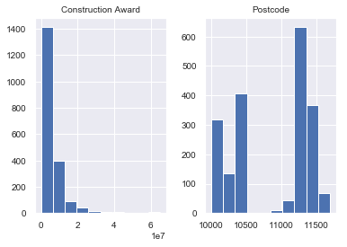


```python
print(school[school['Project type'] == 'CAP'].describe())
school[school['Project type'] == 'CAP'].hist()
```

           Construction Award      Postcode
    count        1.290000e+02    129.000000
    mean         4.308453e+07  11036.806202
    std          3.194690e+07    482.983891
    min          3.623990e+05  10007.000000
    25%          9.271638e+06  10469.000000
    50%          4.383400e+07  11232.000000
    75%          6.936056e+07  11375.000000
    max          9.882000e+07  11435.000000


    array([[<matplotlib.axes._subplots.AxesSubplot object at 0x1a1c0c50f0>,
            <matplotlib.axes._subplots.AxesSubplot object at 0x1a169ee668>]],
          dtype=object)


### 4. Aggregate School Data by Zip Code


```python
school_group = school.groupby(['Postcode']).agg({'Postcode':'size', 'Construction Award':'sum'}).rename(columns = {'Postcode':'construction_count', 'Construction Award':'total_cons_award'})
school_group['mean_cons_award']= school_group.total_cons_award/school_group.construction_count

```


```python
school_group.sort_values('mean_cons_award',ascending= False).head()
```


<div>
<style scoped>
    .dataframe tbody tr th:only-of-type {
        vertical-align: middle;
    }

    .dataframe tbody tr th {
        vertical-align: top;
    }

    .dataframe thead th {
        text-align: right;
    }
</style>
<table border="1" class="dataframe">
  <thead>
    <tr style="text-align: right;">
      <th></th>
      <th>construction_count</th>
      <th>total_cons_award</th>
      <th>mean_cons_award</th>
    </tr>
    <tr>
      <th>Postcode</th>
      <th></th>
      <th></th>
      <th></th>
    </tr>
  </thead>
  <tbody>
    <tr>
      <th>10470.0</th>
      <td>2</td>
      <td>101754000.0</td>
      <td>5.087700e+07</td>
    </tr>
    <tr>
      <th>11423.0</th>
      <td>1</td>
      <td>42808000.0</td>
      <td>4.280800e+07</td>
    </tr>
    <tr>
      <th>11377.0</th>
      <td>17</td>
      <td>693823004.0</td>
      <td>4.081312e+07</td>
    </tr>
    <tr>
      <th>10014.0</th>
      <td>9</td>
      <td>327374000.0</td>
      <td>3.637489e+07</td>
    </tr>
    <tr>
      <th>11368.0</th>
      <td>25</td>
      <td>878963039.0</td>
      <td>3.515852e+07</td>
    </tr>
  </tbody>
</table>
</div>


```python
school_group.sort_values('mean_cons_award',ascending= False).tail()
```


<div>
<style scoped>
    .dataframe tbody tr th:only-of-type {
        vertical-align: middle;
    }

    .dataframe tbody tr th {
        vertical-align: top;
    }

    .dataframe thead th {
        text-align: right;
    }
</style>
<table border="1" class="dataframe">
  <thead>
    <tr style="text-align: right;">
      <th></th>
      <th>construction_count</th>
      <th>total_cons_award</th>
      <th>mean_cons_award</th>
    </tr>
    <tr>
      <th>Postcode</th>
      <th></th>
      <th></th>
      <th></th>
    </tr>
  </thead>
  <tbody>
    <tr>
      <th>11102.0</th>
      <td>2</td>
      <td>818000.0</td>
      <td>409000.000000</td>
    </tr>
    <tr>
      <th>10309.0</th>
      <td>6</td>
      <td>2292190.0</td>
      <td>382031.666667</td>
    </tr>
    <tr>
      <th>11360.0</th>
      <td>3</td>
      <td>1127000.0</td>
      <td>375666.666667</td>
    </tr>
    <tr>
      <th>11358.0</th>
      <td>1</td>
      <td>365696.0</td>
      <td>365696.000000</td>
    </tr>
    <tr>
      <th>11239.0</th>
      <td>2</td>
      <td>589142.0</td>
      <td>294571.000000</td>
    </tr>
  </tbody>
</table>
</div>


# D. Join the Two Datasets using Zip Code as index


```python
combined_df = school_group.merge(df_group, how = 'inner', on = ['Postcode'])
```


```python
combined_df.head()
```


<div>
<style scoped>
    .dataframe tbody tr th:only-of-type {
        vertical-align: middle;
    }

    .dataframe tbody tr th {
        vertical-align: top;
    }

    .dataframe thead th {
        text-align: right;
    }
</style>
<table border="1" class="dataframe">
  <thead>
    <tr style="text-align: right;">
      <th></th>
      <th>Postcode</th>
      <th>construction_count</th>
      <th>total_cons_award</th>
      <th>mean_cons_award</th>
      <th>BOROUGH</th>
      <th>properties_sold_count</th>
      <th>mean_sale_price</th>
      <th>mean_val_sq_ft</th>
    </tr>
  </thead>
  <tbody>
    <tr>
      <th>0</th>
      <td>10002.0</td>
      <td>19</td>
      <td>8.325511e+07</td>
      <td>4.381848e+06</td>
      <td>1.0</td>
      <td>207</td>
      <td>3.633588e+06</td>
      <td>1556.085043</td>
    </tr>
    <tr>
      <th>1</th>
      <td>10003.0</td>
      <td>18</td>
      <td>2.537106e+08</td>
      <td>1.409503e+07</td>
      <td>1.0</td>
      <td>190</td>
      <td>5.681995e+06</td>
      <td>1793.995398</td>
    </tr>
    <tr>
      <th>2</th>
      <td>10007.0</td>
      <td>2</td>
      <td>5.339096e+06</td>
      <td>2.669548e+06</td>
      <td>1.0</td>
      <td>158</td>
      <td>7.265565e+06</td>
      <td>2271.472083</td>
    </tr>
    <tr>
      <th>3</th>
      <td>10009.0</td>
      <td>11</td>
      <td>2.521490e+07</td>
      <td>2.292264e+06</td>
      <td>1.0</td>
      <td>134</td>
      <td>3.816680e+06</td>
      <td>1409.895456</td>
    </tr>
    <tr>
      <th>4</th>
      <td>10010.0</td>
      <td>5</td>
      <td>9.010800e+06</td>
      <td>1.802160e+06</td>
      <td>1.0</td>
      <td>151</td>
      <td>4.708613e+06</td>
      <td>2170.760554</td>
    </tr>
  </tbody>
</table>
</div>


```python
combined_df.shape
```


    (159, 8)


# E. Exploratory Data Analysis and Statistical Analyses

### 1. Initial Scatter Plot for *Mean Value per Sqft vs Construction Award by Zip Code* and Correlation Matrix

- Graph appears very spread out
- correlation is a 0.008062 correlation (practically zero) - likely meaning my Hypothesis is incorrect


```python
params = {'axes.titlesize':'20',
          'xtick.labelsize':'15',
          'ytick.labelsize':'15'}
plt.rcParams.update(params)
combined_df.plot(kind = 'scatter', x = 'mean_val_sq_ft', y = 'mean_cons_award', figsize=(20,10))
plt.title('Mean Value per Sqft vs Construction Award by Zip Code',fontsize=20)
plt.xlabel('Mean Value per Square Foot', fontsize=15)
plt.ylabel('Mean School Construction $', fontsize=15)
```

    'c' argument looks like a single numeric RGB or RGBA sequence, which should be avoided as value-mapping will have precedence in case its length matches with 'x' & 'y'.  Please use a 2-D array with a single row if you really want to specify the same RGB or RGBA value for all points.


    Text(0, 0.5, 'Mean School Construction $')


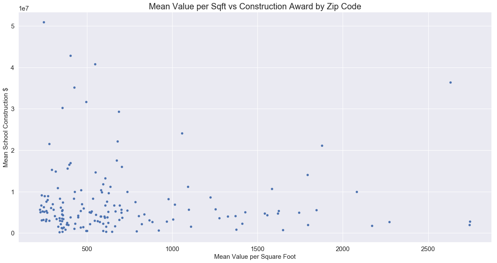


```python
combined_df.corr()
```


<div>
<style scoped>
    .dataframe tbody tr th:only-of-type {
        vertical-align: middle;
    }

    .dataframe tbody tr th {
        vertical-align: top;
    }

    .dataframe thead th {
        text-align: right;
    }
</style>
<table border="1" class="dataframe">
  <thead>
    <tr style="text-align: right;">
      <th></th>
      <th>Postcode</th>
      <th>construction_count</th>
      <th>total_cons_award</th>
      <th>mean_cons_award</th>
      <th>BOROUGH</th>
      <th>properties_sold_count</th>
      <th>mean_sale_price</th>
      <th>mean_val_sq_ft</th>
    </tr>
  </thead>
  <tbody>
    <tr>
      <th>Postcode</th>
      <td>1.000000</td>
      <td>0.057177</td>
      <td>0.094203</td>
      <td>0.052276</td>
      <td>0.684198</td>
      <td>0.133849</td>
      <td>-0.071185</td>
      <td>-0.397203</td>
    </tr>
    <tr>
      <th>construction_count</th>
      <td>0.057177</td>
      <td>1.000000</td>
      <td>0.597794</td>
      <td>0.036117</td>
      <td>-0.050487</td>
      <td>0.275486</td>
      <td>-0.110899</td>
      <td>-0.158835</td>
    </tr>
    <tr>
      <th>total_cons_award</th>
      <td>0.094203</td>
      <td>0.597794</td>
      <td>1.000000</td>
      <td>0.624704</td>
      <td>0.010922</td>
      <td>0.104603</td>
      <td>-0.065819</td>
      <td>-0.058585</td>
    </tr>
    <tr>
      <th>mean_cons_award</th>
      <td>0.052276</td>
      <td>0.036117</td>
      <td>0.624704</td>
      <td>1.000000</td>
      <td>0.031935</td>
      <td>-0.013952</td>
      <td>-0.067419</td>
      <td>-0.008062</td>
    </tr>
    <tr>
      <th>BOROUGH</th>
      <td>0.684198</td>
      <td>-0.050487</td>
      <td>0.010922</td>
      <td>0.031935</td>
      <td>1.000000</td>
      <td>0.367666</td>
      <td>-0.141704</td>
      <td>-0.494778</td>
    </tr>
    <tr>
      <th>properties_sold_count</th>
      <td>0.133849</td>
      <td>0.275486</td>
      <td>0.104603</td>
      <td>-0.013952</td>
      <td>0.367666</td>
      <td>1.000000</td>
      <td>-0.154342</td>
      <td>-0.095500</td>
    </tr>
    <tr>
      <th>mean_sale_price</th>
      <td>-0.071185</td>
      <td>-0.110899</td>
      <td>-0.065819</td>
      <td>-0.067419</td>
      <td>-0.141704</td>
      <td>-0.154342</td>
      <td>1.000000</td>
      <td>0.117319</td>
    </tr>
    <tr>
      <th>mean_val_sq_ft</th>
      <td>-0.397203</td>
      <td>-0.158835</td>
      <td>-0.058585</td>
      <td>-0.008062</td>
      <td>-0.494778</td>
      <td>-0.095500</td>
      <td>0.117319</td>
      <td>1.000000</td>
    </tr>
  </tbody>
</table>
</div>


### 2. Add Log Transformation to diminish the large spread of the data points 
(million dollars in 'Mean School Construction' vs thousand dollars for mean val per sq foot)
- Correlation does not change


```python

combined_df['LOG_mean_cons_award'] = np.log(combined_df['mean_cons_award'])
```


```python
combined_df['LOG_mean_val_sq_ft'] =np.log(combined_df['mean_val_sq_ft'])
```


```python
params = {'axes.titlesize':'20',
          'xtick.labelsize':'15',
          'ytick.labelsize':'15'}
plt.rcParams.update(params)
combined_df.plot(kind='scatter', x='LOG_mean_val_sq_ft', y='LOG_mean_cons_award', figsize = (10,8))
plt.title('LOG Mean Value per Sqft vs LOG Construction Award by Zip Code',fontsize=20)
plt.xlabel('Log Mean Value per Square Foot', fontsize=15)
plt.ylabel('Log Mean School Construction $', fontsize=15)
```

    'c' argument looks like a single numeric RGB or RGBA sequence, which should be avoided as value-mapping will have precedence in case its length matches with 'x' & 'y'.  Please use a 2-D array with a single row if you really want to specify the same RGB or RGBA value for all points.


    Text(0, 0.5, 'Log Mean School Construction $')


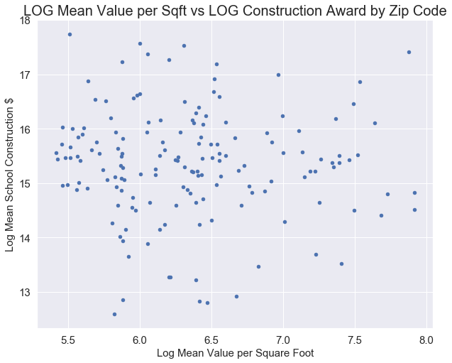


```python
sns.lmplot( x='LOG_mean_val_sq_ft', y='LOG_mean_cons_award', data=combined_df, aspect=1.5, scatter_kws={'alpha':0.2})
plt.title('LOG Mean Value per Sqft vs LOG Construction Award by Zip Code',fontsize=20)
plt.xlabel('Log Mean Value per Square Foot', fontsize=15)
plt.ylabel('Log Mean School Construction $', fontsize=15)
```

    /anaconda3/lib/python3.6/site-packages/matplotlib/tight_layout.py:181: UserWarning: Tight layout not applied. The bottom and top margins cannot be made large enough to accommodate all axes decorations. 
      warnings.warn('Tight layout not applied. '


    Text(51.965, 0.5, 'Log Mean School Construction $')


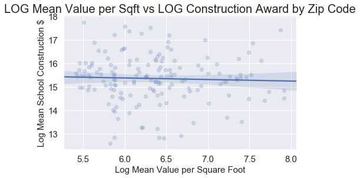


```python
combined_df.corr() #virtually no correlation between the two features still
```


<div>
<style scoped>
    .dataframe tbody tr th:only-of-type {
        vertical-align: middle;
    }

    .dataframe tbody tr th {
        vertical-align: top;
    }

    .dataframe thead th {
        text-align: right;
    }
</style>
<table border="1" class="dataframe">
  <thead>
    <tr style="text-align: right;">
      <th></th>
      <th>Postcode</th>
      <th>construction_count</th>
      <th>total_cons_award</th>
      <th>mean_cons_award</th>
      <th>BOROUGH</th>
      <th>properties_sold_count</th>
      <th>mean_sale_price</th>
      <th>mean_val_sq_ft</th>
      <th>LOG_mean_cons_award</th>
      <th>LOG_mean_val_sq_ft</th>
    </tr>
  </thead>
  <tbody>
    <tr>
      <th>Postcode</th>
      <td>1.000000</td>
      <td>0.057177</td>
      <td>0.094203</td>
      <td>0.052276</td>
      <td>0.684198</td>
      <td>0.133849</td>
      <td>-0.071185</td>
      <td>-0.397203</td>
      <td>0.011297</td>
      <td>-0.294930</td>
    </tr>
    <tr>
      <th>construction_count</th>
      <td>0.057177</td>
      <td>1.000000</td>
      <td>0.597794</td>
      <td>0.036117</td>
      <td>-0.050487</td>
      <td>0.275486</td>
      <td>-0.110899</td>
      <td>-0.158835</td>
      <td>0.280722</td>
      <td>-0.182698</td>
    </tr>
    <tr>
      <th>total_cons_award</th>
      <td>0.094203</td>
      <td>0.597794</td>
      <td>1.000000</td>
      <td>0.624704</td>
      <td>0.010922</td>
      <td>0.104603</td>
      <td>-0.065819</td>
      <td>-0.058585</td>
      <td>0.648767</td>
      <td>-0.072919</td>
    </tr>
    <tr>
      <th>mean_cons_award</th>
      <td>0.052276</td>
      <td>0.036117</td>
      <td>0.624704</td>
      <td>1.000000</td>
      <td>0.031935</td>
      <td>-0.013952</td>
      <td>-0.067419</td>
      <td>-0.008062</td>
      <td>0.807465</td>
      <td>-0.034163</td>
    </tr>
    <tr>
      <th>BOROUGH</th>
      <td>0.684198</td>
      <td>-0.050487</td>
      <td>0.010922</td>
      <td>0.031935</td>
      <td>1.000000</td>
      <td>0.367666</td>
      <td>-0.141704</td>
      <td>-0.494778</td>
      <td>-0.065194</td>
      <td>-0.438023</td>
    </tr>
    <tr>
      <th>properties_sold_count</th>
      <td>0.133849</td>
      <td>0.275486</td>
      <td>0.104603</td>
      <td>-0.013952</td>
      <td>0.367666</td>
      <td>1.000000</td>
      <td>-0.154342</td>
      <td>-0.095500</td>
      <td>0.035866</td>
      <td>-0.130256</td>
    </tr>
    <tr>
      <th>mean_sale_price</th>
      <td>-0.071185</td>
      <td>-0.110899</td>
      <td>-0.065819</td>
      <td>-0.067419</td>
      <td>-0.141704</td>
      <td>-0.154342</td>
      <td>1.000000</td>
      <td>0.117319</td>
      <td>-0.207299</td>
      <td>0.093717</td>
    </tr>
    <tr>
      <th>mean_val_sq_ft</th>
      <td>-0.397203</td>
      <td>-0.158835</td>
      <td>-0.058585</td>
      <td>-0.008062</td>
      <td>-0.494778</td>
      <td>-0.095500</td>
      <td>0.117319</td>
      <td>1.000000</td>
      <td>-0.015947</td>
      <td>0.943172</td>
    </tr>
    <tr>
      <th>LOG_mean_cons_award</th>
      <td>0.011297</td>
      <td>0.280722</td>
      <td>0.648767</td>
      <td>0.807465</td>
      <td>-0.065194</td>
      <td>0.035866</td>
      <td>-0.207299</td>
      <td>-0.015947</td>
      <td>1.000000</td>
      <td>-0.040307</td>
    </tr>
    <tr>
      <th>LOG_mean_val_sq_ft</th>
      <td>-0.294930</td>
      <td>-0.182698</td>
      <td>-0.072919</td>
      <td>-0.034163</td>
      <td>-0.438023</td>
      <td>-0.130256</td>
      <td>0.093717</td>
      <td>0.943172</td>
      <td>-0.040307</td>
      <td>1.000000</td>
    </tr>
  </tbody>
</table>
</div>


```python
combined_df.describe(include='all')
```


<div>
<style scoped>
    .dataframe tbody tr th:only-of-type {
        vertical-align: middle;
    }

    .dataframe tbody tr th {
        vertical-align: top;
    }

    .dataframe thead th {
        text-align: right;
    }
</style>
<table border="1" class="dataframe">
  <thead>
    <tr style="text-align: right;">
      <th></th>
      <th>Postcode</th>
      <th>construction_count</th>
      <th>total_cons_award</th>
      <th>mean_cons_award</th>
      <th>BOROUGH</th>
      <th>properties_sold_count</th>
      <th>mean_sale_price</th>
      <th>mean_val_sq_ft</th>
      <th>LOG_mean_cons_award</th>
      <th>LOG_mean_val_sq_ft</th>
    </tr>
  </thead>
  <tbody>
    <tr>
      <th>count</th>
      <td>159.000000</td>
      <td>159.000000</td>
      <td>1.590000e+02</td>
      <td>1.590000e+02</td>
      <td>159.000000</td>
      <td>159.000000</td>
      <td>1.590000e+02</td>
      <td>159.000000</td>
      <td>159.000000</td>
      <td>159.000000</td>
    </tr>
    <tr>
      <th>mean</th>
      <td>10841.691824</td>
      <td>13.459119</td>
      <td>1.022861e+08</td>
      <td>7.392245e+06</td>
      <td>2.918239</td>
      <td>237.490566</td>
      <td>2.700268e+06</td>
      <td>705.724911</td>
      <td>15.350629</td>
      <td>6.351741</td>
    </tr>
    <tr>
      <th>std</th>
      <td>558.112540</td>
      <td>9.261833</td>
      <td>1.261257e+08</td>
      <td>8.402488e+06</td>
      <td>1.272735</td>
      <td>164.001153</td>
      <td>9.082293e+06</td>
      <td>527.139800</td>
      <td>0.998131</td>
      <td>0.613655</td>
    </tr>
    <tr>
      <th>min</th>
      <td>10002.000000</td>
      <td>1.000000</td>
      <td>3.656960e+05</td>
      <td>2.945710e+05</td>
      <td>1.000000</td>
      <td>6.000000</td>
      <td>4.007812e+05</td>
      <td>224.521463</td>
      <td>12.593275</td>
      <td>5.413971</td>
    </tr>
    <tr>
      <th>25%</th>
      <td>10308.500000</td>
      <td>6.500000</td>
      <td>2.132820e+07</td>
      <td>2.850962e+06</td>
      <td>2.000000</td>
      <td>115.000000</td>
      <td>7.713420e+05</td>
      <td>355.588567</td>
      <td>14.863152</td>
      <td>5.873774</td>
    </tr>
    <tr>
      <th>50%</th>
      <td>11204.000000</td>
      <td>12.000000</td>
      <td>5.129764e+07</td>
      <td>4.940017e+06</td>
      <td>3.000000</td>
      <td>215.000000</td>
      <td>1.209023e+06</td>
      <td>548.080739</td>
      <td>15.412879</td>
      <td>6.306423</td>
    </tr>
    <tr>
      <th>75%</th>
      <td>11359.000000</td>
      <td>19.000000</td>
      <td>1.502150e+08</td>
      <td>8.328527e+06</td>
      <td>4.000000</td>
      <td>327.000000</td>
      <td>2.357100e+06</td>
      <td>788.276020</td>
      <td>15.935192</td>
      <td>6.669838</td>
    </tr>
    <tr>
      <th>max</th>
      <td>11694.000000</td>
      <td>38.000000</td>
      <td>8.789630e+08</td>
      <td>5.087700e+07</td>
      <td>5.000000</td>
      <td>1033.000000</td>
      <td>1.132949e+08</td>
      <td>2745.436418</td>
      <td>17.744922</td>
      <td>7.917695</td>
    </tr>
  </tbody>
</table>
</div>


### 3. Statistical Tests for Normality - Shapiro Wilk Test and D’Agostino’s K^2 Test

- It's possible my data is not normally distributed and if so, I would have to use a non parametric model on my data
- I will graph and test for a Gaussian (normal)distribution


```python
def shapiro_wilk(data): #null hyp is data is normally dist
    stat, p = shapiro(data)
    print('Statistics=%.3f, p=%.3f' % (stat, p))
    # interpret
    alpha = 0.05
    if p > alpha:
        print('Shapiro Results: Sample looks Gaussian (fail to reject H0)')
    else:
        print('Shapiro Results: Sample does not look Gaussian (reject H0)')
    
```


```python
from scipy.stats import normaltest

def dag(data):
    stat, p = normaltest(data)
    print('Statistics=%.3f, p=%.3f' % (stat, p))
    # interpret
    alpha = 0.05
    if p > alpha:
        print('Dag Results: Sample looks Gaussian (fail to reject H0)')
    else:
        print('Dag Results: Sample does not look Gaussian (reject H0)')
```


```python
#test first on random generated data:
from numpy.random import seed
from numpy.random import randn
seed(1)
# generate univariate observations
data = 5 * randn(100) + 50
shapiro_wilk(data)

```

    Statistics=0.992, p=0.822
    Shapiro Results: Sample looks Gaussian (fail to reject H0)


```python
dag(data)
```

    Statistics=0.102, p=0.950
    Dag Results: Sample looks Gaussian (fail to reject H0)


```python
#overall data
shapiro_wilk(combined_df)
```

    Statistics=0.231, p=0.000
    Shapiro Results: Sample does not look Gaussian (reject H0)


```python
shapiro_wilk(combined_df['mean_cons_award'])

dag(combined_df['mean_cons_award'])

plt.title('Mean Construction Award Distribution',fontsize=20)
combined_df['mean_cons_award'].hist(color ='orange')
```

    Statistics=0.678, p=0.000
    Shapiro Results: Sample does not look Gaussian (reject H0)
    Statistics=111.986, p=0.000
    Dag Results: Sample does not look Gaussian (reject H0)


    <matplotlib.axes._subplots.AxesSubplot at 0x1a175f42e8>


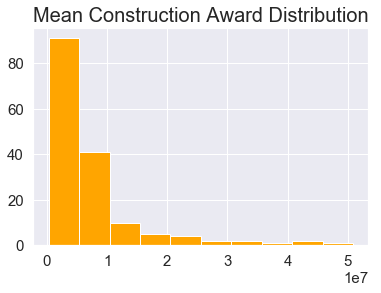


```python
#differing results
shapiro_wilk(combined_df['LOG_mean_cons_award'])
dag(combined_df['LOG_mean_cons_award'])

plt.title('LOG Mean Construction Award Distribution',fontsize=20)
combined_df['LOG_mean_cons_award'].hist(color = 'red')
```

    Statistics=0.979, p=0.017
    Shapiro Results: Sample does not look Gaussian (reject H0)
    Statistics=4.069, p=0.131
    Dag Results: Sample looks Gaussian (fail to reject H0)


    <matplotlib.axes._subplots.AxesSubplot at 0x1a19307208>


```python
shapiro_wilk(combined_df['mean_val_sq_ft'])

dag(combined_df['mean_val_sq_ft'])

plt.title('Mean Property Value per Square Foot',fontsize=20)

combined_df['mean_val_sq_ft'].hist()
```

    Statistics=0.772, p=0.000
    Shapiro Results: Sample does not look Gaussian (reject H0)
    Statistics=67.812, p=0.000
    Dag Results: Sample does not look Gaussian (reject H0)


    <matplotlib.axes._subplots.AxesSubplot at 0x1a17923978>


```python

shapiro_wilk(combined_df['LOG_mean_val_sq_ft'])
dag(combined_df['LOG_mean_val_sq_ft'])
plt.title('LOG Mean Property Value per Square Foot',fontsize=20)


combined_df['LOG_mean_val_sq_ft'].hist(color='green')
```

    Statistics=0.949, p=0.000
    Shapiro Results: Sample does not look Gaussian (reject H0)
    Statistics=10.531, p=0.005
    Dag Results: Sample does not look Gaussian (reject H0)


    <matplotlib.axes._subplots.AxesSubplot at 0x1a197a8160>


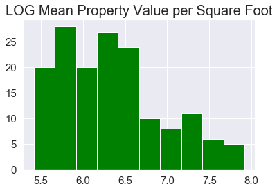


### 4. Further data manipulation needed since data is not normally distributed
- Since data is not correlated nor uniformly distributed, need to bin the mean construction value further to perform classification


```python
school_group.describe()
```


<div>
<style scoped>
    .dataframe tbody tr th:only-of-type {
        vertical-align: middle;
    }

    .dataframe tbody tr th {
        vertical-align: top;
    }

    .dataframe thead th {
        text-align: right;
    }
</style>
<table border="1" class="dataframe">
  <thead>
    <tr style="text-align: right;">
      <th></th>
      <th>construction_count</th>
      <th>total_cons_award</th>
      <th>mean_cons_award</th>
    </tr>
  </thead>
  <tbody>
    <tr>
      <th>count</th>
      <td>158.000000</td>
      <td>1.580000e+02</td>
      <td>1.580000e+02</td>
    </tr>
    <tr>
      <th>mean</th>
      <td>13.354430</td>
      <td>1.019963e+08</td>
      <td>7.407791e+06</td>
    </tr>
    <tr>
      <th>std</th>
      <td>9.196424</td>
      <td>1.264736e+08</td>
      <td>8.426911e+06</td>
    </tr>
    <tr>
      <th>min</th>
      <td>1.000000</td>
      <td>3.656960e+05</td>
      <td>2.945710e+05</td>
    </tr>
    <tr>
      <th>25%</th>
      <td>6.250000</td>
      <td>2.115341e+07</td>
      <td>2.843223e+06</td>
    </tr>
    <tr>
      <th>50%</th>
      <td>12.000000</td>
      <td>5.111662e+07</td>
      <td>4.972606e+06</td>
    </tr>
    <tr>
      <th>75%</th>
      <td>18.750000</td>
      <td>1.507720e+08</td>
      <td>8.341532e+06</td>
    </tr>
    <tr>
      <th>max</th>
      <td>38.000000</td>
      <td>8.789630e+08</td>
      <td>5.087700e+07</td>
    </tr>
  </tbody>
</table>
</div>


```python
school_group['mean_cons_award'] = school_group['mean_cons_award'].apply(lambda x: x/1000)
```


```python
school_group.head() #in thousands
```


<div>
<style scoped>
    .dataframe tbody tr th:only-of-type {
        vertical-align: middle;
    }

    .dataframe tbody tr th {
        vertical-align: top;
    }

    .dataframe thead th {
        text-align: right;
    }
</style>
<table border="1" class="dataframe">
  <thead>
    <tr style="text-align: right;">
      <th></th>
      <th>construction_count</th>
      <th>total_cons_award</th>
      <th>mean_cons_award</th>
    </tr>
    <tr>
      <th>Postcode</th>
      <th></th>
      <th></th>
      <th></th>
    </tr>
  </thead>
  <tbody>
    <tr>
      <th>10002.0</th>
      <td>19</td>
      <td>8.325511e+07</td>
      <td>4381.848098</td>
    </tr>
    <tr>
      <th>10003.0</th>
      <td>18</td>
      <td>2.537106e+08</td>
      <td>14095.031167</td>
    </tr>
    <tr>
      <th>10007.0</th>
      <td>2</td>
      <td>5.339096e+06</td>
      <td>2669.548000</td>
    </tr>
    <tr>
      <th>10009.0</th>
      <td>11</td>
      <td>2.521490e+07</td>
      <td>2292.263636</td>
    </tr>
    <tr>
      <th>10010.0</th>
      <td>5</td>
      <td>9.010800e+06</td>
      <td>1802.160000</td>
    </tr>
  </tbody>
</table>
</div>


```python
school_group.describe()
```


<div>
<style scoped>
    .dataframe tbody tr th:only-of-type {
        vertical-align: middle;
    }

    .dataframe tbody tr th {
        vertical-align: top;
    }

    .dataframe thead th {
        text-align: right;
    }
</style>
<table border="1" class="dataframe">
  <thead>
    <tr style="text-align: right;">
      <th></th>
      <th>construction_count</th>
      <th>total_cons_award</th>
      <th>mean_cons_award</th>
    </tr>
  </thead>
  <tbody>
    <tr>
      <th>count</th>
      <td>158.000000</td>
      <td>1.580000e+02</td>
      <td>158.000000</td>
    </tr>
    <tr>
      <th>mean</th>
      <td>13.354430</td>
      <td>1.019963e+08</td>
      <td>7407.790608</td>
    </tr>
    <tr>
      <th>std</th>
      <td>9.196424</td>
      <td>1.264736e+08</td>
      <td>8426.910973</td>
    </tr>
    <tr>
      <th>min</th>
      <td>1.000000</td>
      <td>3.656960e+05</td>
      <td>294.571000</td>
    </tr>
    <tr>
      <th>25%</th>
      <td>6.250000</td>
      <td>2.115341e+07</td>
      <td>2843.223037</td>
    </tr>
    <tr>
      <th>50%</th>
      <td>12.000000</td>
      <td>5.111662e+07</td>
      <td>4972.605853</td>
    </tr>
    <tr>
      <th>75%</th>
      <td>18.750000</td>
      <td>1.507720e+08</td>
      <td>8341.532055</td>
    </tr>
    <tr>
      <th>max</th>
      <td>38.000000</td>
      <td>8.789630e+08</td>
      <td>50877.000000</td>
    </tr>
  </tbody>
</table>
</div>


```python
school_bins = [0,2843,4972,8342,50880] #low,medium,high,very_high school construction funding
```


```python
school_binned = pd.cut(school_group['mean_cons_award'], school_bins, labels=["low", "medium", "high", "very high"])
print(school_binned.value_counts())
school_binned.value_counts().plot(kind='bar')
```

    very high    40
    low          40
    high         39
    medium       39
    Name: mean_cons_award, dtype: int64


    <matplotlib.axes._subplots.AxesSubplot at 0x1a1af49978>


```python
school_group["cons_award_category"]=school_binned
```


```python
combined_df2 = school_group.merge(df_group, how = 'inner', on = ['Postcode'])
```


```python
combined_df2.head()
```


<div>
<style scoped>
    .dataframe tbody tr th:only-of-type {
        vertical-align: middle;
    }

    .dataframe tbody tr th {
        vertical-align: top;
    }

    .dataframe thead th {
        text-align: right;
    }
</style>
<table border="1" class="dataframe">
  <thead>
    <tr style="text-align: right;">
      <th></th>
      <th>Postcode</th>
      <th>construction_count</th>
      <th>total_cons_award</th>
      <th>mean_cons_award</th>
      <th>cons_award_category</th>
      <th>BOROUGH</th>
      <th>properties_sold_count</th>
      <th>mean_sale_price</th>
      <th>mean_val_sq_ft</th>
    </tr>
  </thead>
  <tbody>
    <tr>
      <th>0</th>
      <td>10002.0</td>
      <td>19</td>
      <td>8.325511e+07</td>
      <td>4381.848098</td>
      <td>medium</td>
      <td>1.0</td>
      <td>207</td>
      <td>3.633588e+06</td>
      <td>1556.085043</td>
    </tr>
    <tr>
      <th>1</th>
      <td>10003.0</td>
      <td>18</td>
      <td>2.537106e+08</td>
      <td>14095.031167</td>
      <td>very high</td>
      <td>1.0</td>
      <td>190</td>
      <td>5.681995e+06</td>
      <td>1793.995398</td>
    </tr>
    <tr>
      <th>2</th>
      <td>10007.0</td>
      <td>2</td>
      <td>5.339096e+06</td>
      <td>2669.548000</td>
      <td>low</td>
      <td>1.0</td>
      <td>158</td>
      <td>7.265565e+06</td>
      <td>2271.472083</td>
    </tr>
    <tr>
      <th>3</th>
      <td>10009.0</td>
      <td>11</td>
      <td>2.521490e+07</td>
      <td>2292.263636</td>
      <td>low</td>
      <td>1.0</td>
      <td>134</td>
      <td>3.816680e+06</td>
      <td>1409.895456</td>
    </tr>
    <tr>
      <th>4</th>
      <td>10010.0</td>
      <td>5</td>
      <td>9.010800e+06</td>
      <td>1802.160000</td>
      <td>low</td>
      <td>1.0</td>
      <td>151</td>
      <td>4.708613e+06</td>
      <td>2170.760554</td>
    </tr>
  </tbody>
</table>
</div>


```python
# params = {'axes.titlesize':'20',
#           'xtick.labelsize':'15',
#           'ytick.labelsize':'15'}
plt.rcParams.update(params)
ax = sns.scatterplot(x="mean_val_sq_ft", y="total_cons_award", hue="cons_award_category",data=combined_df2)
sns.set(rc={'figure.figsize':(20,10)})
plt.legend(loc='upper right', fontsize = 15)
plt.title('Classifying based on Mean Value Squared',fontsize = 15)
```


    Text(0.5, 1.0, 'Classifying based on Mean Value Squared')


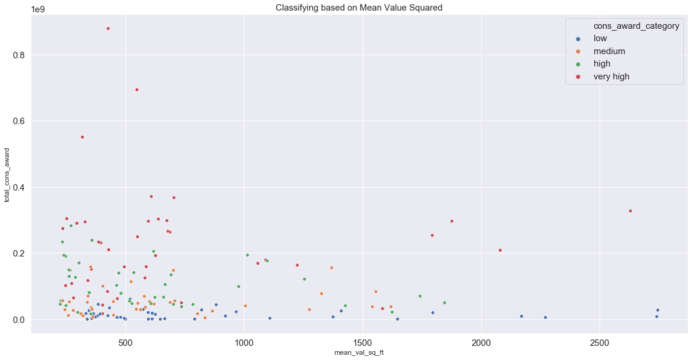


# F. Model - K Nearest Neighbor

- After testing my data for normality and seeing that my data was not uniformly distributed, I was limited to nonparametric machine learning algorithms

- I graphed the classifications (above) and noticed that, overall, data points classified in the same category, were in close proximity to one another when graphed for other variables

- As a result, I chose K Nearest Neighbor(KNN) to run my model because the algorithm uses distance between datapoints to classify other data points

- Additionally, my hypothesis was incorrect and I could no longer assume there was linear relationship between my data. No prior assumptions about the data are needed to use KNN. 

- Finally, since my dataset is pretty small (less than 200 zip codes), a model could be run quickly


```python
y = combined_df2['cons_award_category']
X = combined_df2.drop(columns='cons_award_category')
print(X.shape)
print(y.shape)
```

    (159, 8)
    (159,)


```python

X_train, X_test, y_train, y_test = train_test_split(X, y, test_size=0.2, random_state=1)
scaler = StandardScaler()  
scaler.fit(X_train)

X_train = scaler.transform(X_train)  #scaled the model since data points went up to the millions
X_test = scaler.transform(X_test)  


model = KNeighborsClassifier(n_neighbors=1)
model.fit(X_train, y_train)

y_predict = model.predict(X_test)
```

    /anaconda3/lib/python3.6/site-packages/sklearn/preprocessing/data.py:625: DataConversionWarning: Data with input dtype int64, float64 were all converted to float64 by StandardScaler.
      return self.partial_fit(X, y)
    /anaconda3/lib/python3.6/site-packages/ipykernel_launcher.py:6: DataConversionWarning: Data with input dtype int64, float64 were all converted to float64 by StandardScaler.
      
    /anaconda3/lib/python3.6/site-packages/ipykernel_launcher.py:7: DataConversionWarning: Data with input dtype int64, float64 were all converted to float64 by StandardScaler.
      import sys


# G. Model Interpretation

### 1. F-1 Score weighted for all the classifications

- Measures accuracy by considering both the Precision and the Recall; closer to 1 is ideal

- In this case, the f1_score is weighted based on the number of data points in each category

- For non weighted F-1 score, the model was much better at predicting the zip codes receiving "Very High" School Construction Awards per project (.90) and worst at predicting the "High" category (.29)


```python
f1_score(y_test, y_predict, average='weighted')
# overall, model did okay
```


    0.5504464285714286


```python

print(confusion_matrix(y_test, y_predict))  
print(classification_report(y_test, y_predict))

```

    [[2 2 2 0]
     [2 3 2 0]
     [2 3 3 0]
     [2 0 0 9]]
                  precision    recall  f1-score   support
    
            high       0.25      0.33      0.29         6
             low       0.38      0.43      0.40         7
          medium       0.43      0.38      0.40         8
       very high       1.00      0.82      0.90        11
    
       micro avg       0.53      0.53      0.53        32
       macro avg       0.51      0.49      0.50        32
    weighted avg       0.58      0.53      0.55        32
    


### 2. Finding a better N (neighbor) value based on F1 Score
- Model will perform best with 6 neighbors choosing the category
- The new F-1 scores showed an improvement in the lower categories


```python
# search for an optimal value of K for KNN
k_range = list(range(1, 11))
k_scores = []
for k in k_range:
    knn = KNeighborsClassifier(n_neighbors=k)
    knn.fit(X_train, y_train)
    y_predict = knn.predict(X_test)
    score = f1_score(y_test, y_predict, average='weighted')
    k_scores.append( score)
```


```python

plt.figure(figsize=(12, 6))  
plt.plot(range(1, 11), k_scores, color='red', linestyle='dashed', marker='o',  
         markerfacecolor='blue', markersize=10)
plt.title('F1 score by N Value',fontsize = 15)  
plt.xlabel('N Value',fontsize = 15)  
plt.ylabel('F1 Score',fontsize = 15) 
plt.show()
```


```python

model = KNeighborsClassifier(n_neighbors=6)
model.fit(X_train, y_train)

y_predict = model.predict(X_test)

f1_score(y_test, y_predict, average='weighted')
```


    0.5835957080200501


```python

print(confusion_matrix(y_test, y_predict))  
print(classification_report(y_test, y_predict))

```

    [[3 2 1 0]
     [1 4 2 0]
     [3 2 3 0]
     [3 0 0 8]]
                  precision    recall  f1-score   support
    
            high       0.30      0.50      0.37         6
             low       0.50      0.57      0.53         7
          medium       0.50      0.38      0.43         8
       very high       1.00      0.73      0.84        11
    
       micro avg       0.56      0.56      0.56        32
       macro avg       0.57      0.54      0.54        32
    weighted avg       0.63      0.56      0.58        32
    


# H. Analysis 

I hypothesized that NYC's most expensive neighborhoods received the most school capital construction funding by project.  

My hypothesis was incorrect; the correlation between mean value per square foot by neighborhood and mean construction award per project was very close to zero.

After 
